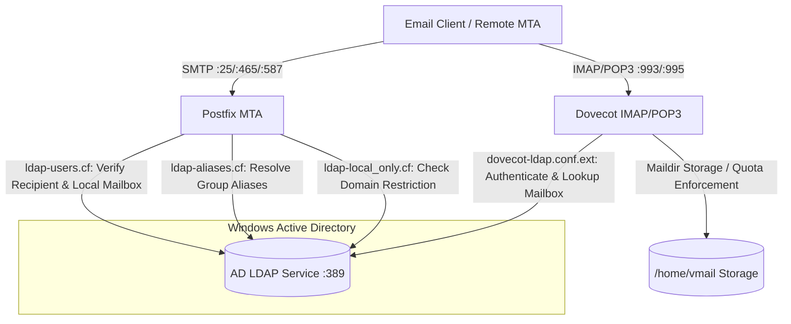
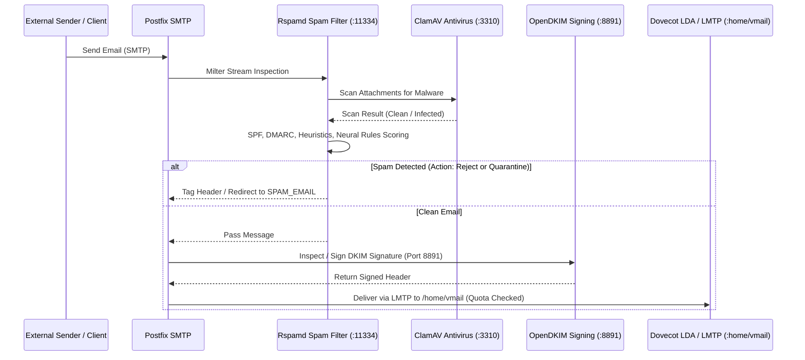

# System Architecture & Technical Operations Guide

🌐 **Language / 語言 / Ngôn ngữ**:  
[English](ARCHITECTURE.md) | [繁體中文](ARCHITECTURE.zh-TW.md) | [简体中文](ARCHITECTURE.zh-CN.md) | [Tiếng Việt](ARCHITECTURE.vi.md)

---

## 📌 Introduction
This document provides an in-depth technical overview of the **docker-Postfix-AD** container architecture. It explains how Postfix, Dovecot, Active Directory (LDAP), Rspamd, ClamAV, OpenDKIM, and SSL/TLS certificates interact.

- **Main README**: [README.md](README.md)
- **Online Config Generator**: [https://williamfromtw.github.io/docker-Postfix-AD/genLaunchCommand.html](https://williamfromtw.github.io/docker-Postfix-AD/genLaunchCommand.html)
- **Online Interactive Architecture Viewer**: [https://williamfromtw.github.io/docker-Postfix-AD/architecture.html](https://williamfromtw.github.io/docker-Postfix-AD/architecture.html)

---

## 🏛️ 1. Overall Architecture & Active Directory (LDAP) Integration

The container integrates **Postfix** (MTA) and **Dovecot** (IMAP/POP3) with **Microsoft Active Directory** via LDAP queries on Port 389.



### 📋 Active Directory (AD) Configuration Rules
1. **Account Name Casing**:
   - Account login names in AD **MUST be lower-case** (e.g., `520001` or `john`). Dovecot automatically converts login usernames to lower-case for LDAP queries.
2. **Email Address (`mail` Attribute)**:
   - In AD Users and Computers, set the user's email address in the `mail` attribute (e.g., `john@example.com`).
   - The login username and the email address can be completely different.
3. **Group Aliases (`ALIASES`)**:
   - Create an AD Group, set its `mail` attribute to the desired alias (e.g., `sales@example.com`), and add recipient user accounts as members of this group.
4. **Local Domain Only Restriction (`local_only`)**:
   - Set the `description` attribute of an AD User or Group to `local_only`.
   - Postfix will block this account/group from sending or receiving external emails, allowing only internal domain communication.

---

## 🛡️ 2. Mail Filtering & Security Pipeline (Postfix + Rspamd + ClamAV + OpenDKIM)

Every incoming and outgoing email traverses a milter filtering pipeline managed by Postfix:



### 🔧 Rspamd Web UI & Password Configuration
- **Web UI URL**: `http://<host-ip>:11334`
- **Default Password**: `kafeiou.pw`
- **Generate Encrypted Password**:
  ```bash
  docker exec -it mailserver rspamadm pw --encrypt -p <your_new_password>
  ```
  Paste the output hash into `/etc/rspamd/local.d/worker-controller.inc`.
- **Spam Redirection (`SPAM_EMAIL`)**:
  When `SPAM_EMAIL` is configured, emails classified as spam with quarantine action will be automatically redirected to the specified mailbox (e.g., `spam@example.com`).

---

## 🔐 3. SSL/TLS Certificate Architecture & Let's Encrypt Management

The container is designed to be **out-of-the-box ready** while supporting seamless enterprise Let's Encrypt certificate renewal.

```mermaid
graph TD
    subgraph Container Startup (setup.sh)
        A{Check /etc/letsencrypt/live/HOST_NAME/fullchain.pem}
        A -->|Not Found| B[Execute /make_fake_cert.sh]
        B --> C[Generate Self-Signed Fake Certificate]
        C --> D[Postfix & Dovecot SSL Services Start Immediately]
        A -->|Found| E[Directly Load Official Let's Encrypt Certificate]
        E --> D
    end

    subgraph Host Maintenance (Production SSL via DNS-01)
        F[Administrator runs Certbot DNS-01 on Host] --> G[Obtain Real Wildcard / SAN Certificate]
        G --> H[Store in Host /etc/letsencrypt]
        H -->|Volume Mapping| I[Container Accesses Updated Certificate]
        I --> J[Reload Services inside Container]
    end
```

### 🚀 Zero-Configuration Startup (`make_fake_cert.sh`)
- When the container starts for the first time, if `/etc/letsencrypt/live/${HOST_NAME}/fullchain.pem` is not present, `setup.sh` automatically invokes `/make_fake_cert.sh ${HOST_NAME}`.
- This creates a self-signed certificate structure matching Let's Encrypt's layout (`cert.pem`, `privkey.pem`, `chain.pem`, `fullchain.pem`), allowing Postfix and Dovecot TLS listeners (Ports 465, 587, 993, 995) to start immediately without crashing.

### 🌐 Updating to Official Let's Encrypt Certificate (DNS-01 Challenge)
Because email servers typically do not run HTTP on Port 80, the **DNS-01 Challenge** via Certbot on the Docker Host is strongly recommended:

1. **Install Certbot on Docker Host**:
   ```bash
   sudo apt install certbot  # Ubuntu/Debian
   # or sudo dnf install certbot  # RHEL/Rocky Linux
   ```

2. **Issue Certificate via DNS Challenge**:
   ```bash
   sudo certbot certonly --manual --preferred-challenges dns -d mail.example.com -d example.com
   ```
   Follow the prompt to add the `_acme-challenge` TXT record in your DNS provider.

3. **Reload Container SSL Services**:
   Once the certificates are placed in the host's `/etc/letsencrypt/live/mail.example.com/`, reload the container services:
   ```bash
   docker exec -it mailserver postfix reload
   docker exec -it mailserver dovecot reload
   ```

---

## 🔑 4. DKIM & SPF Configuration Manual

### 1. Enable OpenDKIM in Container
1. Enter the container:
   ```bash
   docker exec -it mailserver bash
   ```
2. Uncomment the milter configuration in `/etc/postfix/main.cf`:
   ```text
   smtpd_milters = inet:127.0.0.1:8891
   non_smtpd_milters = $smtpd_milters
   milter_default_action = accept
   ```
3. Reload Postfix:
   ```bash
   postfix reload
   ```

### 2. Multi-Domain DKIM Generation (`/getOpenDKIM.sh`)
1. Edit `/getOpenDKIM.sh` and list your domains:
   ```bash
   domains=( 
     'example.com'
     'example2.com'
   )
   ```
2. Run the script:
   ```bash
   /getOpenDKIM.sh
   ```
3. The generated public keys will be located in `/etc/opendkim/keys/<domain>/default.txt`.

### 3. Public DNS Records Configuration
Configure the following records in your DNS provider:

#### A. SPF Record (TXT Record on apex `@` or domain)
```text
Type:  TXT
Host:  @ (or example.com)
Value: v=spf1 ip4:<YOUR_SERVER_PUBLIC_IP> mx ~all
```

#### B. DKIM Record (TXT Record)
```text
Type:  TXT
Host:  default._domainkey
Value: v=DKIM1; k=rsa; p=<PUBLIC_KEY_STRING_FROM_default.txt>
```

#### C. DMARC Record (TXT Record)
```text
Type:  TXT
Host:  _dmarc
Value: v=DMARC1; p=quarantine; rua=mailto:postmaster@example.com
```

---

## ⚡ 5. Performance Tuning, Troubleshooting & Fail2ban

### 1. Fail2ban & Real Client IP
To ensure fail2ban on the host can read real client IPs from `/var/log/maillog` for automated IP banning, running with **`--net=host`** (or `network_mode: host` in Compose) is strongly recommended.

### 2. Performance Tuning
Key configuration files inside the container:
- `/etc/dovecot/conf.d/10-auth.conf`:
  ```text
  auth_cache_size = 256M
  auth_cache_verify_password_with_worker = yes
  auth_cache_ttl = 3600s
  ```
- `/etc/dovecot/conf.d/10-master.conf`:
  ```text
  default_vsz_limit = 256M
  ```
- `/etc/dovecot/conf.d/90-quota.conf`: Adjust default mailbox quota rules.

### 3. Service Health Check & Diagnostics
```bash
# Check all supervisor managed services
docker exec -it mailserver supervisorctl status

# Test local listening ports
docker exec -it mailserver telnet localhost 25    # Postfix SMTP
docker exec -it mailserver telnet localhost 143   # Dovecot IMAP
docker exec -it mailserver telnet localhost 8891  # OpenDKIM
docker exec -it mailserver telnet localhost 11334 # Rspamd
docker exec -it mailserver telnet localhost 12340 # Quota Service
```
