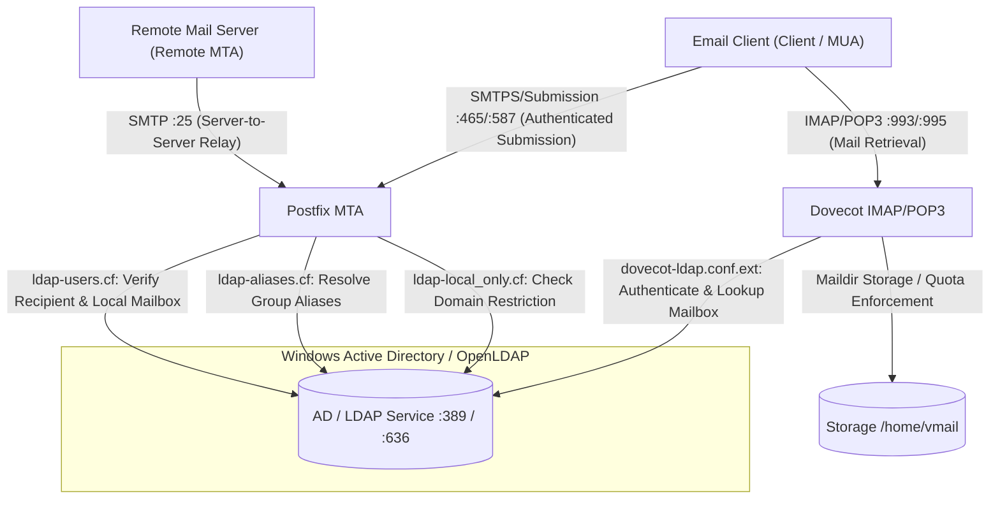
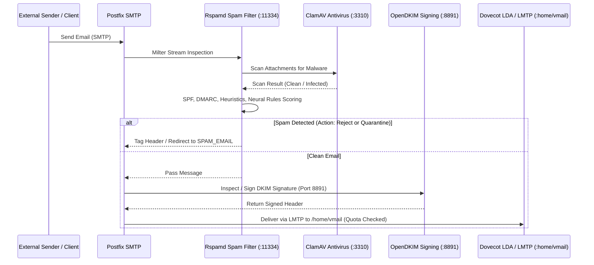
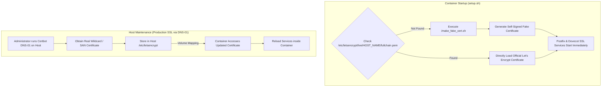
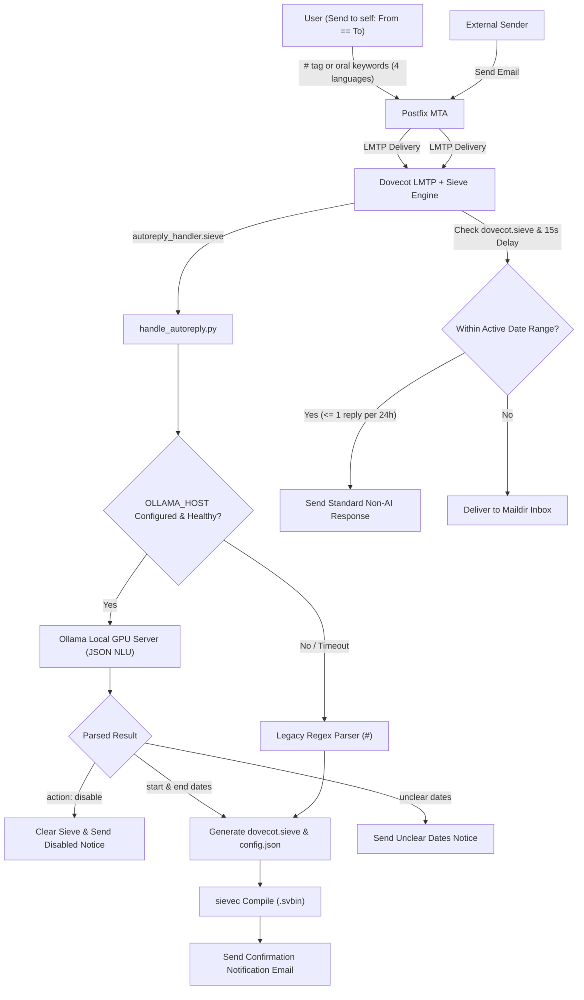
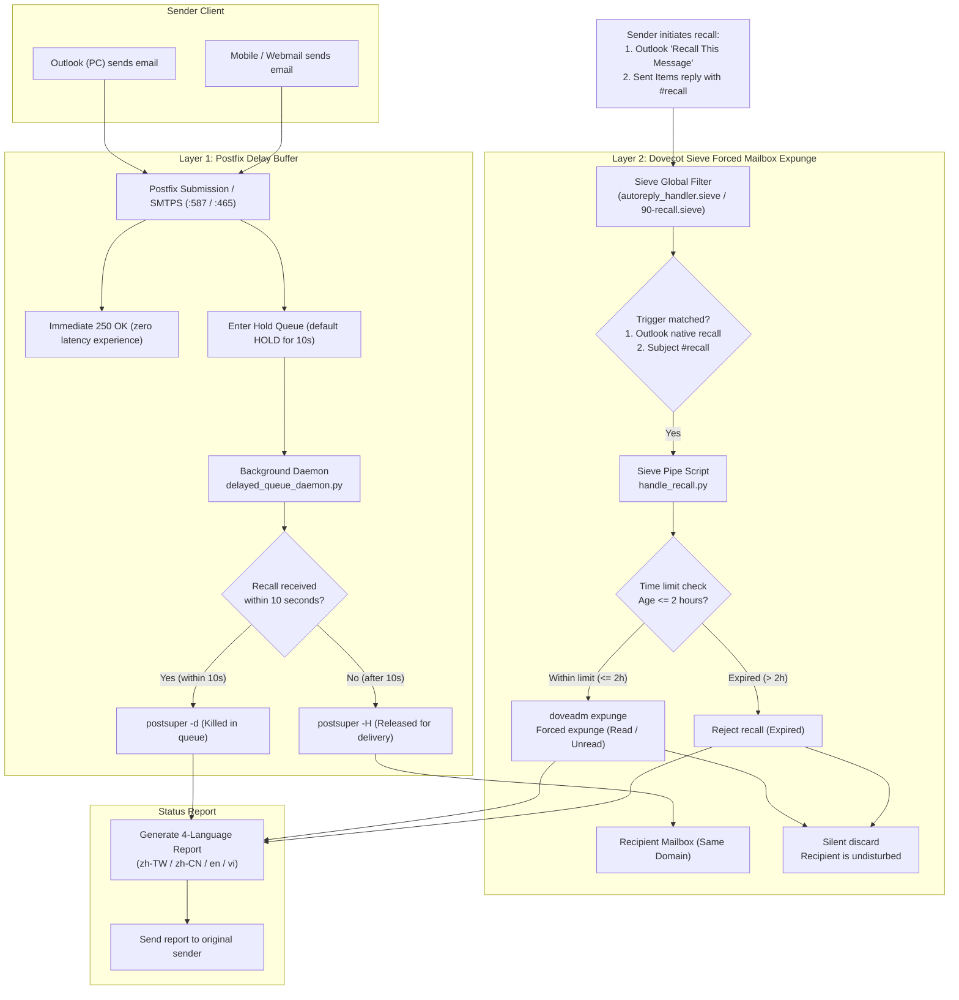

# System Architecture & Technical Operations Guide

🌐 **Language / 語言 / Ngôn ngữ**:  
[English](ARCHITECTURE.md) | [繁體中文](ARCHITECTURE.zh-TW.md) | [简体中文](ARCHITECTURE.zh-CN.md) | [Tiếng Việt](ARCHITECTURE.vi.md)

---

## 📌 Introduction
This document provides an in-depth technical overview of the **docker-Postfix-AD** container architecture. It explains how Postfix, Dovecot, Active Directory (LDAP), Rspamd, ClamAV, OpenDKIM, and SSL/TLS certificates interact.

- **Main README**: [README.md](README.md)
- **Online Config Generator**: [https://williamfromtw.github.io/docker-Postfix-AD/genLaunchCommand.html](https://williamfromtw.github.io/docker-Postfix-AD/genLaunchCommand.html)
- **Online Interactive Architecture Viewer**: [https://williamfromtw.github.io/docker-Postfix-AD/architecture.html](https://williamfromtw.github.io/docker-Postfix-AD/architecture.html)

---

## 🏛️ 1. Overall Architecture & Active Directory / LDAP Integration Model
 
The container integrates **Postfix** (MTA) and **Dovecot** (IMAP/POP3) with **Microsoft Active Directory** or **OpenLDAP**. It connects via standard Port 389 by default, and supports switching to Port 636 (LDAPS TLS encryption) via `ENABLE_LDAPS=true`.



### 📋 Active Directory (AD) / OpenLDAP Field Specification & Auth Policy
1. **Login Authentication Restricted to Pure Username (`sAMAccountName` / `uid`)**:
   - When configuring mail clients (Outlook, Thunderbird, mobile devices), **the username field must be the pure account/employee ID** (`sAMAccountName` or `uid`, e.g. `520001` or `john`, in lowercase). **Logging in with `@domain` or email address is strictly prohibited**.
2. **Email Address (`mail` attribute)**:
   - Enter the full email address (e.g. `john@smile.taipei`) in the `mail` attribute.
   - Login account and email address are completely independent. Incoming messages are routed via the `mail` attribute to `/home/vmail/john@smile.taipei`.
3. **Group Aliases (`ALIASES`)**:
   - Create an AD Group, set its `mail` attribute to the desired alias (e.g., `sales@example.com`), and add recipient user accounts as members of this group.
4. **Local Domain Only Restriction (`local_only`)**:
   - Set the `description` attribute of an AD User or Group to `local_only`.
   - Postfix will block this account/group from sending or receiving external emails, allowing only internal domain communication.

---

## 🛡️ 2. Mail Filtering & Security Pipeline (Postfix + Rspamd + ClamAV + OpenDKIM)

Every incoming and outgoing email traverses a milter filtering pipeline managed by Postfix:



### 🔧 Rspamd Web UI & Password Configuration
- **Web UI URL**: `http://<host-ip>:11334`
- **Default Password**: `kafeiou.pw`
- **Generate Encrypted Password**:
  ```bash
  docker exec -it mailserver rspamadm pw --encrypt -p <your_new_password>
  ```
  Paste the output hash into `/etc/rspamd/local.d/worker-controller.inc`.
- **Spam Redirection (`SPAM_EMAIL`)**:
  When `SPAM_EMAIL` is configured, emails classified as spam with quarantine action will be automatically redirected to the specified mailbox (e.g., `spam@example.com`).
- **Comprehensive Rspamd Guide**:
  For detailed instructions on whitelist/blacklist maps, regex keywords, dangerous extensions, and false-positive rescue, refer to **[Rspamd Security Guide (RSPAMD.md)](RSPAMD.md)**.

---

## 🔐 3. SSL/TLS Certificate Architecture & Let's Encrypt Management

The container is designed to be **out-of-the-box ready** while supporting seamless enterprise Let's Encrypt certificate renewal.



### 🚀 Zero-Configuration Startup (`make_fake_cert.sh`)
- When the container starts for the first time, if `/etc/letsencrypt/live/${HOST_NAME}/fullchain.pem` is not present, `setup.sh` automatically invokes `/make_fake_cert.sh ${HOST_NAME}`.
- This creates a self-signed certificate structure matching Let's Encrypt's layout (`cert.pem`, `privkey.pem`, `chain.pem`, `fullchain.pem`), allowing Postfix and Dovecot TLS listeners (Ports 465, 587, 993, 995) to start immediately without crashing.

### 🌐 Updating to Official Let's Encrypt Certificate (DNS-01 Challenge)
Because email servers typically do not run HTTP on Port 80, the **DNS-01 Challenge** via Certbot on the Docker Host is strongly recommended:

1. **Install Certbot on Docker Host**:
   ```bash
   sudo apt install certbot  # Ubuntu/Debian
   # or sudo dnf install certbot  # RHEL/Rocky Linux
   ```

2. **Issue Certificate via DNS Challenge**:
   ```bash
   sudo certbot certonly --manual --preferred-challenges dns -d mail.example.com -d example.com
   ```
   Follow the prompt to add the `_acme-challenge` TXT record in your DNS provider.

3. **Reload Container SSL Services**:
   Once the certificates are placed in the host's `/etc/letsencrypt/live/mail.example.com/`, reload the container services:
   ```bash
   docker exec -it mailserver postfix reload
   docker exec -it mailserver dovecot reload
   ```

---

## 🔑 4. DKIM & SPF Configuration Manual

### 1. Enable OpenDKIM in Container
1. Enter the container:
   ```bash
   docker exec -it mailserver bash
   ```
2. Uncomment the milter configuration in `/etc/postfix/main.cf`:
   ```text
   smtpd_milters = inet:127.0.0.1:8891
   non_smtpd_milters = $smtpd_milters
   milter_default_action = accept
   ```
3. Reload Postfix:
   ```bash
   postfix reload
   ```

### 2. Multi-Domain DKIM Generation (`/getOpenDKIM.sh`)
1. Edit `/getOpenDKIM.sh` and list your domains:
   ```bash
   domains=( 
     'example.com'
     'example2.com'
   )
   ```
2. Run the script:
   ```bash
   /getOpenDKIM.sh
   ```
3. The generated public keys will be located in `/etc/opendkim/keys/<domain>/default.txt`.

### 3. Public DNS Records Configuration
Configure the following records in your DNS provider:

#### A. SPF Record (TXT Record on apex `@` or domain)
```text
Type:  TXT
Host:  @ (or example.com)
Value: v=spf1 ip4:<YOUR_SERVER_PUBLIC_IP> mx ~all
```

#### B. DKIM Record (TXT Record)
```text
Type:  TXT
Host:  default._domainkey
Value: v=DKIM1; k=rsa; p=<PUBLIC_KEY_STRING_FROM_default.txt>
```

#### C. DMARC Record (TXT Record)
```text
Type:  TXT
Host:  _dmarc
Value: v=DMARC1; p=quarantine; rua=mailto:postmaster@example.com
```

---

## 🤖 5. Email-Driven Auto-Reply & Vacation Responder (Sieve & LMTP)

For environments without a Webmail GUI, the system provides a smart **Email-Driven Auto-Reply / Vacation** mechanism powered by Postfix LMTP, Dovecot Pigeonhole Sieve, and Sieve Extprograms.



### 📩 How Users Enable / Disable Auto-Reply

Users simply send an email **to themselves (From == To)** from any desktop/mobile email client:

#### 0. 🤖 Local Ollama AI Natural Language Leave Mode (LAN GPU Server, 4 Languages)
When `OLLAMA_HOST` is configured (e.g. `http://192.168.1.100:11434`), users can naturally phrase their out-of-office intentions without memorizing commands:
- **English**: Subject `Out of office until next Monday` or `Tomorrow on leave`
- **Traditional Chinese**: Subject `我下週三到五休假去日本` or `明天下午請假去看牙醫`
- **Simplified Chinese**: Subject `我下周一到周三出差北京` or `明天请假一天`
- **Vietnamese**: Subject `Tôi xin nghỉ phép từ thứ 4 đến thứ 6 tuần sau` or `Ngày mai tôi đi công tác`
- **Oral Cancellation**: Simply send an email saying `Cancel out of office`, `我銷假了`, or `Tôi đã đi làm lại` to immediately disable the auto-responder!
- **Zero AI Hallucination**: AI is strictly limited to extracting date intervals and intent. Outbound reply bodies always use standardized, enterprise-compliant templates (or user's explicitly provided email body).
- **Graceful Fallback**: If the GPU host is offline or times out (default 5s), it seamlessly falls back to legacy `#` regex matching.

##### ⚙️ How to Switch Ollama Models & Tune Environment Variables
You can switch the LLM used by Ollama at any time (e.g. `qwen2.5:7b`, `qwen2.5:3b`, or `qwen3.6:27b-q8_0`) by setting the following environment variables in `docker-compose.yaml` or Docker run commands:

| Environment Variable | Default | Description |
| :--- | :--- | :--- |
| `OLLAMA_HOST` | *(Unset)* | Ollama API endpoint (e.g. `http://10.192.130.184:11434`) |
| `OLLAMA_MODEL` | *(Unset / Auto-detected)* | **Model to use** (e.g. `qwen3.8-200k:latest`, `qwen2.5:7b`). No hardcoded default; if empty, dynamically discovers running or installed models on Ollama server. |
| `OLLAMA_TIMEOUT` | `180` | Request timeout in seconds (default: 180s). Provides ample time even for pure CPU inference or 27B+ models. |

* **Model Recommendations**:
  * **GPU Top Recommendation `qwen3.8-200k:latest` or `qwen2.5:7b`**: Full GPU acceleration, ~1~3s inference with exceptional 4-language extraction.
  * **Lightweight Alternative `qwen2.5:3b`**: ~1.9 GB. Ideal for pure CPU or low-resource hosts (1~2s response).
  * **Large Models & CPU Inference**: The default 180s timeout ensures models like 27B running on pure CPU have enough time to complete inference.

#### 1. Enable with Date Range (Legacy `#` Command, Timezone: UTC+8 / Asia/Taipei)
- **To**: `your_email@example.com`
- **Subject**: `#autoreply 2026-08-25 ~ 2026-08-30 Out of Office / Vacation`
- **Body**: Fill in your custom out-of-office message, delegate contact info, or emergency phone numbers.
- *System automatically activates on 2026-08-25 00:00:00 and expires on 2026-08-30 23:59:59 (UTC+8).*

- **Subject**: `#autoreply on Out of Office`
- **Body**: Custom message.

#### 3. Disable / Cancel Immediately
- **Subject**: `#autoreply off` (or `#autoreply cancel`)

#### 4. Instant Confirmation & Anti-Loop Protection
- The system automatically sends a **Confirmation Email** back to the user upon activation/deactivation.
- **Anti-Loop (`:days 1`)**: The same external sender will receive at most ONE auto-reply every 24 hours, preventing email storm loops.

---

## ⚡ 6. Performance Tuning, Troubleshooting & Fail2ban

### 1. Fail2ban & Real Client IP
To ensure fail2ban on the host can read real client IPs from `/var/log/maillog` for automated IP banning, running with **`--net=host`** (or `network_mode: host` in Compose) is strongly recommended.

### 2. Performance Tuning
Key configuration files inside the container:
- `/etc/dovecot/conf.d/10-auth.conf`:
  ```text
  auth_cache_size = 256M
  auth_cache_verify_password_with_worker = yes
  auth_cache_ttl = 3600s
  ```
- `/etc/dovecot/conf.d/10-master.conf`:
  ```text
  default_vsz_limit = 256M
  ```
- `/etc/dovecot/conf.d/90-quota.conf`: Adjust default mailbox quota rules.

### 3. Service Health Check & Diagnostics
```bash
# Check all supervisor managed services
docker exec -it mailserver supervisorctl status

# Test local listening ports
docker exec -it mailserver telnet localhost 25    # Postfix SMTP
docker exec -it mailserver telnet localhost 143   # Dovecot IMAP
docker exec -it mailserver telnet localhost 8891  # OpenDKIM
docker exec -it mailserver telnet localhost 11334 # Rspamd
docker exec -it mailserver telnet localhost 12340 # Quota Service
```

---

## 📬 7. Enterprise Two-Tier Message Recall System

This system features an enterprise two-tier message recall mechanism natively compatible with Microsoft Outlook's "Recall This Message" and mobile `#recall` reply commands, resolving traditional IMAP limitations and recipient curiosity issues.

### 🔄 System Architecture Flowchart



### 🎯 Core Operating Principles

1. **Layer 1: Outgoing Delay Buffer**:
   - Outgoing authenticated mail via Port 587 (Submission) or Port 465 (SMTPS) immediately returns `250 OK: queued` to the client, while placing the message in the Postfix Hold queue for `RECALL_DELAY_SECONDS` (default: 10 seconds).
   - If recalled within 10s, the system runs `postsuper -d` to kill the message in the queue; neither internal nor external recipients receive it.
   - If 10s elapses without recall, `delayed_queue_daemon.py` runs `postsuper -H` to release and deliver the message.
   - **Zero Delay Bypass**: Setting `RECALL_DELAY_SECONDS=0` bypasses the Hold queue completely, delivering outbound messages instantly.

2. **Layer 2: Same-Domain Mailbox Forced Expunge**:
   - For messages already delivered to same-domain mailboxes, if recalled within `RECALL_MAX_HOURS` (default: 2 hours), the system invokes `doveadm expunge` by Message-ID.
   - **Forced Deletion**: Regardless of whether the recipient has read the email (`SEEN` flag) or not, the message is physically expunged.
   - **Silent Suppression**: Outlook recall notices (`Recall:` emails) are discarded (`discard`), keeping recipients undisturbed.
   - **Expiration Protection**: Recalls past 2 hours are rejected silently.
   - **External Protection**: For external recipients (e.g. Gmail), outgoing recall notices are suppressed to avoid confusion.

### 📱 Triggering Message Recall

| Client Environment | Action | Detection |
| :--- | :--- | :--- |
| **PC Microsoft Outlook** | Open sent email, select File / Actions ➜ **"Recall This Message"** | `X-MS-Exchange-Organization-Recall-Action` header or `Recall:` / `撤回:` subject prefix |
| **Mobile / Webmail (iOS, Android)** | Open "Sent Items", tap **Reply**, prepend **`#recall`** to Subject and send | Targets original Message-ID via `In-Reply-To` / `References` |

### 🛠️ Container Configuration Guide (`/etc/dovecot/recall.env`)

Configuration is stored directly in `/etc/dovecot/recall.env` inside the container:

```bash
docker exec -it mailserver vi /etc/dovecot/recall.env
```

Default content:
```ini
ENABLE_RECALL="yes"        # Enable recall system (yes / no)
RECALL_DELAY_SECONDS=10    # Layer 1 delay buffer in seconds (0 to disable)
RECALL_MAX_HOURS=2         # Layer 2 same-domain expunge time limit in hours
```

### 💡 Protocol Notes (POP3 vs IMAP)

- **IMAP / Webmail**: Real-time bi-directional sync; expunged messages disappear immediately from the recipient's screen.
- **POP3**:
  - During the initial 10-second delay buffer, the email is not yet in the mailbox, so POP3 clients cannot fetch it (100% intercepted).
  - If already downloaded to a local `.pst` file beyond the buffer window, the server copy is expunged, but the local file cannot be deleted remotely (noted in the status report).

