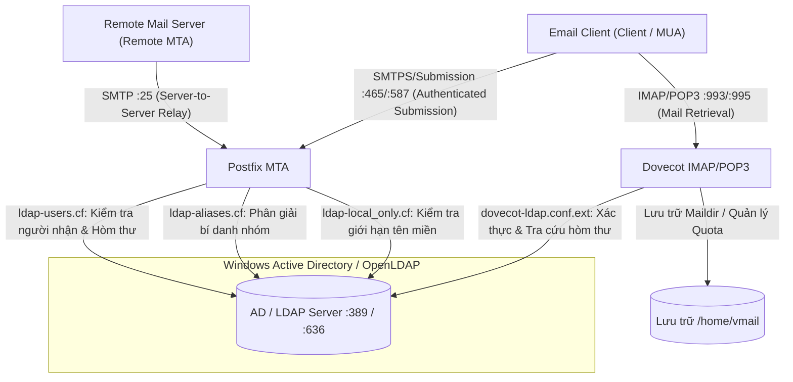
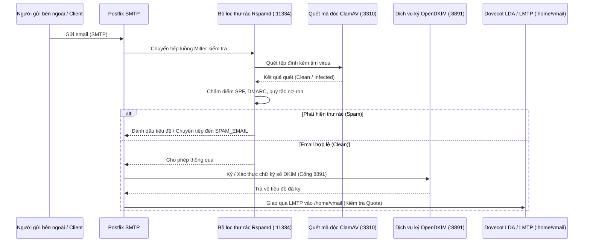
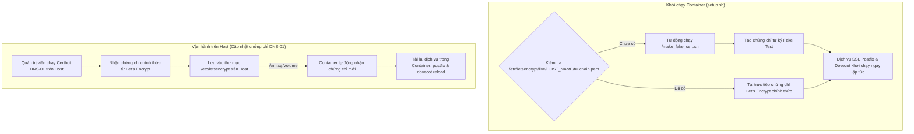
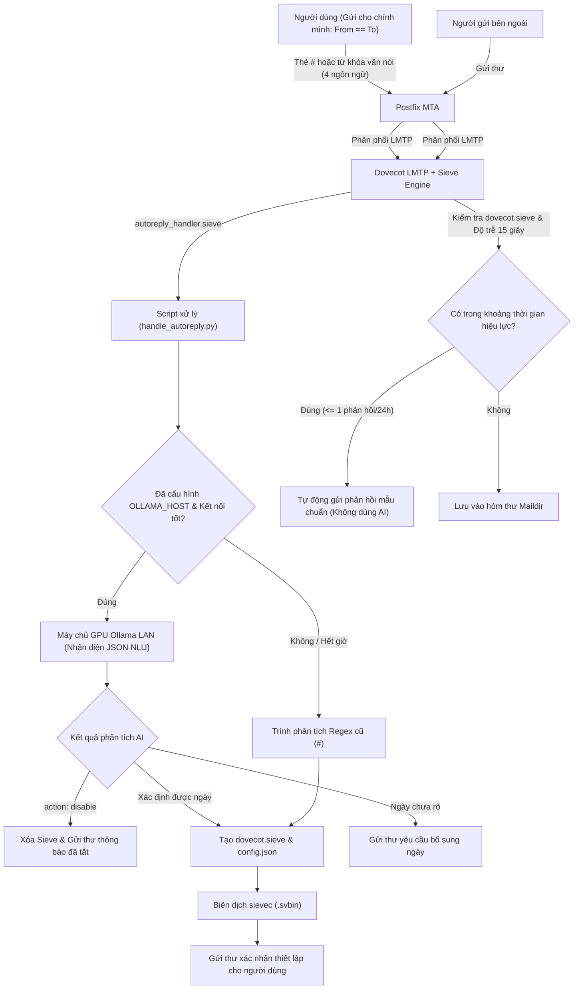

# Kiến Trúc Hệ Thống & Hướng Dẫn Vận Hành Kỹ Thuật

🌐 **Language / 語言 / Ngôn ngữ**:  
[English](ARCHITECTURE.md) | [繁體中文](ARCHITECTURE.zh-TW.md) | [简体中文](ARCHITECTURE.zh-CN.md) | [Tiếng Việt](ARCHITECTURE.vi.md)

---

## 📌 Giới thiệu
Tài liệu này cung cấp cái nhìn kỹ thuật chuyên sâu về kiến trúc container **docker-Postfix-AD**. Giải thích chi tiết cách Postfix, Dovecot, Microsoft Active Directory (LDAP), Rspamd, ClamAV, OpenDKIM và hệ thống chứng chỉ SSL/TLS phối hợp hoạt động.

- **Trang chủ README**: [README.vi.md](README.vi.md)
- **Công cụ tạo cấu hình trực tuyến**: [https://williamfromtw.github.io/docker-Postfix-AD/genLaunchCommand.html](https://williamfromtw.github.io/docker-Postfix-AD/genLaunchCommand.html)
- **Trang xem kiến trúc tương tác trực tuyến**: [https://williamfromtw.github.io/docker-Postfix-AD/architecture.html](https://williamfromtw.github.io/docker-Postfix-AD/architecture.html)

---

## 🏛️ 1. Mô Hình Tích Hợp Active Directory / LDAP
 
Container tích hợp **Postfix** (MTA) và **Dovecot** (IMAP/POP3) trực tiếp với **Microsoft Active Directory** hoặc **OpenLDAP**. Kết nối mặc định qua cổng 389, hỗ trợ chuyển sang cổng 636 (LDAPS TLS) thông qua `ENABLE_LDAPS=true`.



### 📋 Quy chuẩn cấu hình trường Active Directory (AD) / OpenLDAP & Chính sách xác thực
1. **Xác thực đăng nhập bắt buộc dùng tên tài khoản thuần túy (`sAMAccountName` / `uid`)**:
   - Khi cấu hình phần mềm email (Outlook, Thunderbird, điện thoại), **trường tên đăng nhập bắt buộc phải điền mã nhân viên hoặc tài khoản AD/LDAP** (`sAMAccountName` hoặc `uid`, ví dụ: `520001` hoặc `john`, viết thường). **Nghiêm cấm đăng nhập bằng định dạng chứa `@domain` hoặc địa chỉ email**.
2. **Địa chỉ Email (Thuộc tính `mail`)**:
   - Vui lòng điền địa chỉ email đầy đủ (ví dụ: `john@smile.taipei`) vào trường `mail` của người dùng AD/LDAP.
   - Tên tài khoản đăng nhập và địa chỉ email hoàn toàn độc lập. Thư bên ngoài gửi đến sẽ được định tuyến theo thuộc tính `mail` vào `/home/vmail/john@smile.taipei`.
3. **Bí danh nhóm (`ALIASES`)**:
   - Tạo một Group trong AD, điền địa chỉ email bí danh vào thuộc tính `mail` của Group (ví dụ: `sales@smile.taipei`), sau đó thêm các tài khoản thành viên vào Group này.
4. **Giới hạn chỉ gửi nhận nội bộ (`local_only`)**:
   - Đặt thuộc tính `description` của User hoặc Group thành `local_only`.
   - Postfix sẽ chặn tài khoản này gửi/nhận email ra ngoài Internet, chỉ cho phép trao đổi trong mạng nội bộ.

---

## 🛡️ 2. Quy Trình Lọc Thư & Bảo Mật (Postfix + Rspamd + ClamAV + OpenDKIM)

Mọi email ra vào đều đi qua chuỗi lọc Milter được Postfix điều phối:



### 🔧 Giao diện Web Rspamd & Quản lý mật khẩu
- **Địa chỉ Web UI**: `http://<IP-may-chu>:11334`
- **Mật khẩu mặc định**: `kafeiou.pw`
- **Tạo mã băm mật khẩu mới**:
  ```bash
  docker exec -it mailserver rspamadm pw --encrypt -p <mat_khau_moi>
  ```
  Dán chuỗi băm nhận được vào tệp `/etc/rspamd/local.d/worker-controller.inc`.
- **Chuyển tiếp thư rác (`SPAM_EMAIL`)**:
  Khi cấu hình biến `SPAM_EMAIL`, các email bị đánh dấu cách ly sẽ tự động được chuyển tiếp đến hòm thư chỉ định (ví dụ: `spam@smile.taipei`).
- **Hướng Dẫn Rspamd Toàn Diện**:
  Để biết chi tiết về danh sách trắng/đen, từ khóa biểu thức chính quy, tệp nén độc hại và khôi phục thư cách ly, vui lòng xem **[Hướng dẫn Rspamd (RSPAMD.vi.md)](RSPAMD.vi.md)**.

---

## 🔐 3. Kiến Trúc Chứng Chỉ SSL/TLS & Cơ Chế Let's Encrypt

Container được thiết kế để **hoạt động ngay lập tức** (Zero-Configuration) đồng thời hỗ trợ gia hạn chứng chỉ Let's Encrypt chính thức trên máy chủ Host.



### 🚀 Khởi chạy không cần cấu hình trước (`make_fake_cert.sh`)
- Lần đầu tiên khởi chạy container, nếu máy chủ Host chưa có sẵn chứng chỉ, script `setup.sh` sẽ tự động gọi `/make_fake_cert.sh ${HOST_NAME}`.
- Script tạo bộ chứng chỉ tự ký theo cấu trúc chuẩn của Let's Encrypt (`cert.pem`, `privkey.pem`, `chain.pem`, `fullchain.pem`), giúp các dịch vụ SSL/TLS của Postfix và Dovecot (Cổng 465, 587, 993, 995) khởi động ngay lập tức mà không bị lỗi.

### 🌐 Lấy chứng chỉ Let's Encrypt chính thức qua Certbot (Thử thách DNS-01)
Do máy chủ Mail thường không mở cổng HTTP 80, phương pháp **DNS-01 Challenge** trên máy chủ Docker Host là lựa chọn tối ưu nhất:

1. **Cài đặt Certbot trên Host**:
   ```bash
   sudo apt install certbot  # Ubuntu / Debian
   # hoặc sudo dnf install certbot  # RHEL / Rocky Linux
   ```

2. **Yêu cầu cấp chứng chỉ qua DNS**:
   ```bash
   sudo certbot certonly --manual --preferred-challenges dns -d mail.smile.taipei -d smile.taipei
   ```
   Thực hiện thêm bản ghi TXT `_acme-challenge` tại nhà cung cấp DNS của bạn theo hướng dẫn trên màn hình.

3. **Tải lại dịch vụ trong Container**:
   Sau khi chứng chỉ được lưu tại `/etc/letsencrypt/live/mail.smile.taipei/` trên Host, tiến hành tải lại trong container:
   ```bash
   docker exec -it mailserver postfix reload
   docker exec -it mailserver dovecot reload
   ```

---

## 🔑 4. Hướng Dẫn Cấu Hình Chữ Ký Số DKIM & Bản Ghi SPF

### 1. Kích hoạt OpenDKIM trong Container
1. Truy cập vào container:
   ```bash
   docker exec -it mailserver bash
   ```
2. Bỏ chú thích cấu hình milter trong `/etc/postfix/main.cf`:
   ```text
   smtpd_milters = inet:127.0.0.1:8891
   non_smtpd_milters = $smtpd_milters
   milter_default_action = accept
   ```
3. Tải lại Postfix:
   ```bash
   postfix reload
   ```

### 2. Tạo khóa DKIM hàng loạt (`/getOpenDKIM.sh`)
1. Chỉnh sửa tệp `/getOpenDKIM.sh` với danh sách tên miền của bạn:
   ```bash
   domains=( 
     'smile.taipei'
     'example2.com'
   )
   ```
2. Chạy script:
   ```bash
   /getOpenDKIM.sh
   ```
3. Khóa công khai được tạo sẽ nằm tại `/etc/opendkim/keys/<ten_mien>/default.txt`.

### 3. Cấu hình bản ghi DNS TXT
Thêm các bản ghi sau vào bảng điều khiển DNS của bạn:

#### A. Bản ghi SPF (Bản ghi TXT tại `@`)
```text
Loại: TXT
Host: @ (hoặc smile.taipei)
Giá trị: v=spf1 ip4:<IP_PUBLIC_MAY_CHU> mx ~all
```

#### B. Bản ghi DKIM (Bản ghi TXT)
```text
Loại: TXT
Host: default._domainkey
Giá trị: v=DKIM1; k=rsa; p=<CHUOI_KHOA_CONG_KHAI_TRONG_default.txt>
```

#### C. Bản ghi DMARC (Bản ghi TXT)
```text
Loại: TXT
Host: _dmarc
Giá trị: v=DMARC1; p=quarantine; rua=mailto:postmaster@smile.taipei
```

---

## 🤖 5. Tự Động Trả Lời Thư Tự Động Qua Email (Auto-Reply / Vacation Responder)

Đối với môi trường không có giao diện Webmail, hệ thống cung cấp cơ chế **Tự Động Phản Hồi Thư / Báo Nghỉ Phép Qua Email** (kết hợp Postfix LMTP, Dovecot Pigeonhole Sieve và Sieve Extprograms).



### 📩 Cách Người Dùng Bật / Tắt Tự Động Trả Lời

Người dùng chỉ cần **gửi một email cho chính mình (From == To)** từ ứng dụng email trên máy tính hoặc điện thoại:

#### 0. 🤖 Chế độ xin nghỉ phép bằng ngôn ngữ tự nhiên qua Ollama AI cục bộ (Máy chủ GPU LAN, 4 ngôn ngữ)
Khi biến môi trường `OLLAMA_HOST` được cấu hình (ví dụ: `http://192.168.1.100:11434`) và dịch vụ AI hoạt động tốt, người dùng có thể gửi email bằng văn nói tự nhiên:
- **Tiếng Việt**: Tiêu đề “`Tôi xin nghỉ phép từ thứ 4 đến thứ 6 tuần sau`”, “`Ngày mai tôi đi công tác`”
- **Tiếng Anh**: Tiêu đề “`Out of office until next Monday`”, “`I will be on vacation tomorrow`”
- **Tiếng Trung phồn thể**: Tiêu đề “`我下週三到五休假去日本`”, “`明天下午請假去看牙醫`”
- **Tiếng Trung giản thể**: Tiêu đề “`我下周一到周三出差北京`”, “`明天请假一天`”
- **Hủy bằng văn nói**: Gửi email “`Hủy nghỉ phép đợt này`”, “`Tôi đã đi làm lại`”, “`Cancel out of office`” hoặc “`我銷假了`” để tắt tính năng ngay lập tức!
- **Đảm bảo không bịa đặt (Zero Hallucination)**: AI chỉ nhận diện khoảng thời gian và ý định. Nội dung phản hồi ra bên ngoài luôn dùng mẫu chuẩn công ty (hoặc nội dung người dùng tự soạn trong thân thư).
- **Hạ cấp mượt mà**: Nếu máy chủ GPU ngoại tuyến hoặc hết thời gian chờ (mặc định 5s), hệ thống tự động chuyển về phân tích Regex với lệnh `#` truyền thống.

##### ⚙️ Cách Thay Đổi Mô Hình Ollama & Cấu Hình Biến Môi Trường
Bạn có thể thay đổi mô hình LLM được sử dụng trong Ollama bất cứ lúc nào (ví dụ: chuyển sang `qwen2.5:7b`, `qwen2.5:3b` hoặc `qwen3.6:27b-q8_0`) bằng cách chỉ định các biến môi trường trong `docker-compose.yaml` hoặc lệnh chạy container:

| Biến môi trường | Mặc định | Mô tả |
| :--- | :--- | :--- |
| `OLLAMA_HOST` | *(Chưa cấu hình)* | Địa chỉ API Ollama (ví dụ: `http://10.192.130.184:11434`) |
| `OLLAMA_MODEL` | `qwen2.5:7b` | **Tên mô hình muốn sử dụng** (ví dụ: đổi thành `qwen2.5:3b` hoặc `qwen3.6:27b-q8_0`) |
| `OLLAMA_TIMEOUT` | `180` | Thời gian chờ (giây, mặc định 180s). Đảm bảo đủ thời gian ngay cả khi chạy thuần bằng CPU hoặc dùng mô hình 27B+. |

* **Khuyến nghị mô hình**:
  * **Lựa chọn GPU hàng đầu `qwen3.8-200k:latest` hoặc `qwen2.5:7b`**: Tăng tốc toàn bộ trên GPU, thời gian suy luận chỉ khoảng 1~3 giây, nhận diện 4 ngôn ngữ cực kỳ chính xác.
  * **Lựa chọn siêu nhẹ `qwen2.5:3b`**: Khoảng 1.9 GB, chạy mượt mà trên cả CPU (1~2 giây phản hồi).
  * **Mô hình lớn & chạy trên CPU**: Cơ chế bảo vệ timeout mặc định 180 giây đảm bảo các mô hình lớn như 27B chạy trên CPU có đủ thời gian hoàn thành suy luận.

#### 1. Bật với Khoảng Thời Gian (Lệnh `#` truyền thống, Múi giờ: UTC+8 / Asia/Taipei)
- **Người nhận**: Chính mình (`your_email@example.com`)
- **Tiêu đề**: `#autoreply 2026-08-25 ~ 2026-08-30 Đi công tác / Nghỉ phép` (hoặc `#vacation`)
- **Nội dung**: Soạn nội dung bạn muốn tự động gửi lại cho đối tác (người thay thế, số điện thoại khẩn cấp...).
- *Hệ thống sẽ tự động kích hoạt vào lúc 2026-08-25 00:00:00 và tự động hết hạn vào 2026-08-30 23:59:59 (UTC+8).*

#### 2. Chế Độ Luôn Bật (Cho đến khi tắt thủ công)
- **Tiêu đề**: `#autoreply on Đi công tác`
- **Nội dung**: Nội dung phản hồi tùy chỉnh.

#### 3. Tắt / Hủy Ngay Lập Tức
- **Tiêu đề**: `#autoreply off` (hoặc `#autoreply cancel`)

#### 4. Thư Xác Nhận & Bảo Vệ Chống Spam Loop
- Sau khi thiết lập thành công hoặc tắt, hệ thống sẽ **tự động gửi email xác nhận** về hòm thư của bạn kèm xem trước nội dung.
- **Cơ chế chống lặp (`:days 1`)**: Cùng một người gửi bên ngoài trong 24 giờ chỉ nhận được tối đa 1 email tự động phản hồi.

---

## ⚡ 6. Tối Ưu Hiệu Năng, Chẩn Đoán & Fail2ban

### 1. Fail2ban & Nhận diện IP thực của Client
Để fail2ban trên máy chủ Host có thể đọc trực tiếp IP thực từ `/var/log/maillog` để chặn tấn công, khuyến nghị chạy container với **`--net=host`** (hoặc `network_mode: host` trong Compose).

### 2. Các tệp cấu hình quan trọng
- `/etc/dovecot/conf.d/10-auth.conf` (Tối ưu hóa bộ nhớ đệm xác thực)
- `/etc/dovecot/conf.d/10-master.conf` (Giới hạn bộ nhớ VSZ)
- `/etc/dovecot/conf.d/90-quota.conf` (Quy tắc hạn ngạch dung lượng hòm thư)

### 3. Lệnh kiểm tra sức khỏe dịch vụ
```bash
# Kiểm tra trạng thái các tiến trình qua supervisor
docker exec -it mailserver supervisorctl status

# Kiểm tra lắng nghe cổng mạng cục bộ
docker exec -it mailserver telnet localhost 25    # Postfix SMTP
docker exec -it mailserver telnet localhost 143   # Dovecot IMAP
docker exec -it mailserver telnet localhost 8891  # OpenDKIM
docker exec -it mailserver telnet localhost 11334 # Rspamd
docker exec -it mailserver telnet localhost 12340 # Quota Service
```
