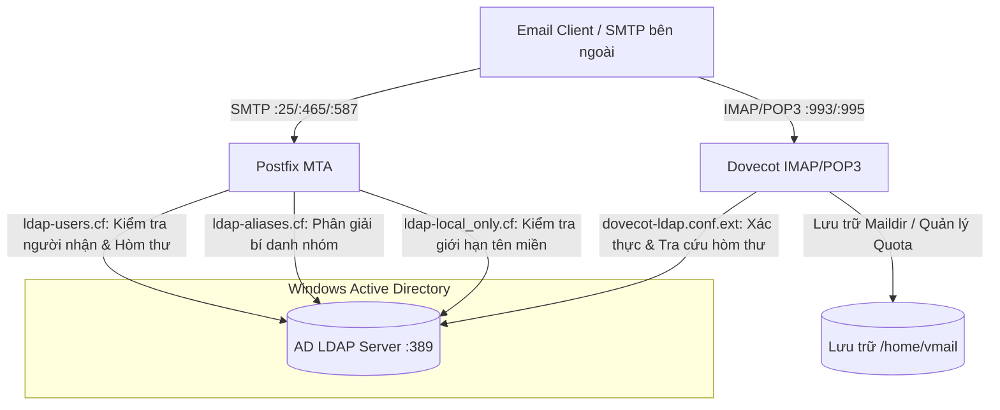
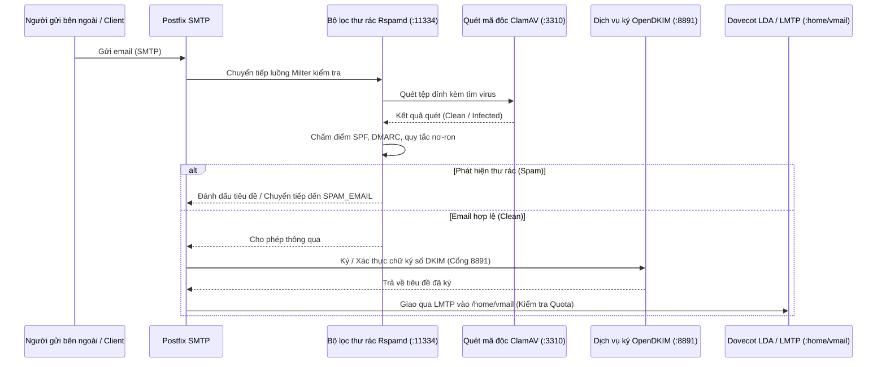

# Kiến Trúc Hệ Thống & Hướng Dẫn Vận Hành Kỹ Thuật

🌐 **Language / 語言 / Ngôn ngữ**:  
[English](ARCHITECTURE.md) | [繁體中文](ARCHITECTURE.zh-TW.md) | [简体中文](ARCHITECTURE.zh-CN.md) | [Tiếng Việt](ARCHITECTURE.vi.md)

---

## 📌 Giới thiệu
Tài liệu này cung cấp cái nhìn kỹ thuật chuyên sâu về kiến trúc container **docker-Postfix-AD**. Giải thích chi tiết cách Postfix, Dovecot, Microsoft Active Directory (LDAP), Rspamd, ClamAV, OpenDKIM và hệ thống chứng chỉ SSL/TLS phối hợp hoạt động.

- **Trang chủ README**: [README.vi.md](README.vi.md)
- **Công cụ tạo cấu hình trực tuyến**: [https://williamfromtw.github.io/docker-Postfix-AD/genLaunchCommand.html](https://williamfromtw.github.io/docker-Postfix-AD/genLaunchCommand.html)
- **Trang xem kiến trúc tương tác trực tuyến**: [https://williamfromtw.github.io/docker-Postfix-AD/architecture.html](https://williamfromtw.github.io/docker-Postfix-AD/architecture.html)

---

## 🏛️ 1. Kiến Trúc Tổng Thể & Tích Hợp Active Directory (LDAP)

Container tích hợp **Postfix** (MTA) và **Dovecot** (IMAP/POP3) trực tiếp với **Microsoft Active Directory** qua giao thức LDAP trên cổng 389.



### 📋 Quy tắc cấu hình Active Directory (AD)
1. **Tên tài khoản bắt buộc viết chữ thường**:
   - Tên đăng nhập người dùng (sAMAccountName) trong AD **bắt buộc phải viết bằng chữ thường** (ví dụ: `520001` hoặc `john`). Dovecot tự động chuyển tên đăng nhập thành chữ thường khi gửi truy vấn LDAP.
2. **Địa chỉ Email (Thuộc tính `mail`)**:
   - Nhập địa chỉ email vào thuộc tính `mail` của User trong AD (ví dụ: `john@smile.taipei`).
   - Tên đăng nhập và địa chỉ email có thể hoàn toàn khác nhau.
3. **Bí danh nhóm (`ALIASES`)**:
   - Tạo một Group trong AD, điền địa chỉ email bí danh vào thuộc tính `mail` của Group (ví dụ: `sales@smile.taipei`), sau đó thêm các tài khoản thành viên vào Group này.
4. **Giới hạn chỉ gửi nhận nội bộ (`local_only`)**:
   - Đặt thuộc tính `description` của User hoặc Group thành `local_only`.
   - Postfix sẽ chặn tài khoản này gửi/nhận email ra ngoài Internet, chỉ cho phép trao đổi trong mạng nội bộ.

---

## 🛡️ 2. Quy Trình Lọc Thư & Bảo Mật (Postfix + Rspamd + ClamAV + OpenDKIM)

Mọi email ra vào đều đi qua chuỗi lọc Milter được Postfix điều phối:



### 🔧 Giao diện Web Rspamd & Quản lý mật khẩu
- **Địa chỉ Web UI**: `http://<IP-may-chu>:11334`
- **Mật khẩu mặc định**: `kafeiou.pw`
- **Tạo mã băm mật khẩu mới**:
  ```bash
  docker exec -it mailserver rspamadm pw --encrypt -p <mat_khau_moi>
  ```
  Dán chuỗi băm nhận được vào tệp `/etc/rspamd/local.d/worker-controller.inc`.
- **Chuyển tiếp thư rác (`SPAM_EMAIL`)**:
  Khi cấu hình biến `SPAM_EMAIL`, các email bị đánh dấu cách ly sẽ tự động được chuyển tiếp đến hòm thư chỉ định (ví dụ: `spam@smile.taipei`).

---

## 🔐 3. Kiến Trúc Chứng Chỉ SSL/TLS & Cơ Chế Let's Encrypt

Container được thiết kế để **hoạt động ngay lập tức** (Zero-Configuration) đồng thời hỗ trợ gia hạn chứng chỉ Let's Encrypt chính thức trên máy chủ Host.

```mermaid
graph TD
    subgraph Khởi chạy Container (setup.sh)
        A{Kiểm tra /etc/letsencrypt/live/HOST_NAME/fullchain.pem}
        A -->|Chưa có| B[Tự động chạy /make_fake_cert.sh]
        B --> C[Tạo chứng chỉ tự ký Fake Test]
        C --> D[Dịch vụ SSL Postfix & Dovecot khởi chạy ngay lập tức]
        A -->|Đã có| E[Tải trực tiếp chứng chỉ Let's Encrypt chính thức]
        E --> D
    end

    subgraph Vận hành trên Host (Cập nhật chứng chỉ DNS-01)
        F[Quản trị viên chạy Certbot DNS-01 trên Host] --> G[Nhận chứng chỉ chính thức từ Let's Encrypt]
        G --> H[Lưu vào thư mục /etc/letsencrypt trên Host]
        H -->|Ánh xạ Volume| I[Container tự động nhận chứng chỉ mới]
        I --> J[Tải lại dịch vụ trong Container: postfix & dovecot reload]
    end
```

### 🚀 Khởi chạy không cần cấu hình trước (`make_fake_cert.sh`)
- Lần đầu tiên khởi chạy container, nếu máy chủ Host chưa có sẵn chứng chỉ, script `setup.sh` sẽ tự động gọi `/make_fake_cert.sh ${HOST_NAME}`.
- Script tạo bộ chứng chỉ tự ký theo cấu trúc chuẩn của Let's Encrypt (`cert.pem`, `privkey.pem`, `chain.pem`, `fullchain.pem`), giúp các dịch vụ SSL/TLS của Postfix và Dovecot (Cổng 465, 587, 993, 995) khởi động ngay lập tức mà không bị lỗi.

### 🌐 Lấy chứng chỉ Let's Encrypt chính thức qua Certbot (Thử thách DNS-01)
Do máy chủ Mail thường không mở cổng HTTP 80, phương pháp **DNS-01 Challenge** trên máy chủ Docker Host là lựa chọn tối ưu nhất:

1. **Cài đặt Certbot trên Host**:
   ```bash
   sudo apt install certbot  # Ubuntu / Debian
   # hoặc sudo dnf install certbot  # RHEL / Rocky Linux
   ```

2. **Yêu cầu cấp chứng chỉ qua DNS**:
   ```bash
   sudo certbot certonly --manual --preferred-challenges dns -d mail.smile.taipei -d smile.taipei
   ```
   Thực hiện thêm bản ghi TXT `_acme-challenge` tại nhà cung cấp DNS của bạn theo hướng dẫn trên màn hình.

3. **Tải lại dịch vụ trong Container**:
   Sau khi chứng chỉ được lưu tại `/etc/letsencrypt/live/mail.smile.taipei/` trên Host, tiến hành tải lại trong container:
   ```bash
   docker exec -it mailserver postfix reload
   docker exec -it mailserver dovecot reload
   ```

---

## 🔑 4. Hướng Dẫn Cấu Hình Chữ Ký Số DKIM & Bản Ghi SPF

### 1. Kích hoạt OpenDKIM trong Container
1. Truy cập vào container:
   ```bash
   docker exec -it mailserver bash
   ```
2. Bỏ chú thích cấu hình milter trong `/etc/postfix/main.cf`:
   ```text
   smtpd_milters = inet:127.0.0.1:8891
   non_smtpd_milters = $smtpd_milters
   milter_default_action = accept
   ```
3. Tải lại Postfix:
   ```bash
   postfix reload
   ```

### 2. Tạo khóa DKIM hàng loạt (`/getOpenDKIM.sh`)
1. Chỉnh sửa tệp `/getOpenDKIM.sh` với danh sách tên miền của bạn:
   ```bash
   domains=( 
     'smile.taipei'
     'example2.com'
   )
   ```
2. Chạy script:
   ```bash
   /getOpenDKIM.sh
   ```
3. Khóa công khai được tạo sẽ nằm tại `/etc/opendkim/keys/<ten_mien>/default.txt`.

### 3. Cấu hình bản ghi DNS TXT
Thêm các bản ghi sau vào bảng điều khiển DNS của bạn:

#### A. Bản ghi SPF (Bản ghi TXT tại `@`)
```text
Loại: TXT
Host: @ (hoặc smile.taipei)
Giá trị: v=spf1 ip4:<IP_PUBLIC_MAY_CHU> mx ~all
```

#### B. Bản ghi DKIM (Bản ghi TXT)
```text
Loại: TXT
Host: default._domainkey
Giá trị: v=DKIM1; k=rsa; p=<CHUOI_KHOA_CONG_KHAI_TRONG_default.txt>
```

#### C. Bản ghi DMARC (Bản ghi TXT)
```text
Loại: TXT
Host: _dmarc
Giá trị: v=DMARC1; p=quarantine; rua=mailto:postmaster@smile.taipei
```

---

## ⚡ 5. Tối Ưu Hiệu Năng, Chẩn Đoán & Fail2ban

### 1. Fail2ban & Nhận diện IP thực của Client
Để fail2ban trên máy chủ Host có thể đọc trực tiếp IP thực từ `/var/log/maillog` để chặn tấn công, khuyến nghị chạy container với **`--net=host`** (hoặc `network_mode: host` trong Compose).

### 2. Các tệp cấu hình quan trọng
- `/etc/dovecot/conf.d/10-auth.conf` (Tối ưu hóa bộ nhớ đệm xác thực)
- `/etc/dovecot/conf.d/10-master.conf` (Giới hạn bộ nhớ VSZ)
- `/etc/dovecot/conf.d/90-quota.conf` (Quy tắc hạn ngạch dung lượng hòm thư)

### 3. Lệnh kiểm tra sức khỏe dịch vụ
```bash
# Kiểm tra trạng thái các tiến trình qua supervisor
docker exec -it mailserver supervisorctl status

# Kiểm tra lắng nghe cổng mạng cục bộ
docker exec -it mailserver telnet localhost 25    # Postfix SMTP
docker exec -it mailserver telnet localhost 143   # Dovecot IMAP
docker exec -it mailserver telnet localhost 8891  # OpenDKIM
docker exec -it mailserver telnet localhost 11334 # Rspamd
docker exec -it mailserver telnet localhost 12340 # Quota Service
```
