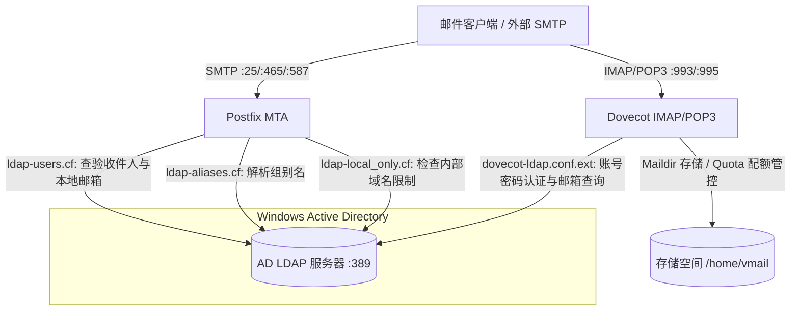
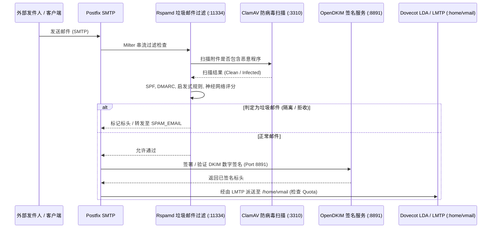
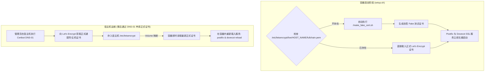

# 系统架构与技术运维指南

🌐 **Language / 語言 / Ngôn ngữ**:  
[English](ARCHITECTURE.md) | [繁體中文](ARCHITECTURE.zh-TW.md) | [简体中文](ARCHITECTURE.zh-CN.md) | [Tiếng Việt](ARCHITECTURE.vi.md)

---

## 📌 简介
本文档提供 **docker-Postfix-AD** 容器技术架构的深度剖析。详细说明 Postfix、Dovecot、微软 Active Directory (LDAP)、Rspamd、ClamAV、OpenDKIM 以及 SSL/TLS 证书体系之间的协同运行流程。

- **项目主页**: [README.zh-CN.md](README.zh-CN.md)
- **在线配置生成器**: [https://williamfromtw.github.io/docker-Postfix-AD/genLaunchCommand.html](https://williamfromtw.github.io/docker-Postfix-AD/genLaunchCommand.html)
- **在线互动架构图网页**: [https://williamfromtw.github.io/docker-Postfix-AD/architecture.html](https://williamfromtw.github.io/docker-Postfix-AD/architecture.html)

---

## 🏛️ 1. 全局架构与 Active Directory (LDAP) 整合模型

本容器将 **Postfix** (MTA 传输代理) 与 **Dovecot** (IMAP/POP3 服务) 通过 LDAP 协议（Port 389）直接与 **微软 Windows Active Directory** 深度整合。



### 📋 Active Directory (AD) 字段配置规范
1. **账号名称必须为小写**：
   - AD 中的用户登录账号（sAMAccountName）**必须创建为全小写**（如 `520001` 或 `john`），因为 Dovecot 查询时固定会转为小写发送查询。
2. **电子邮件地址（`mail` 属性）**：
   - 请在 AD 用户属性中的 `mail` 字段填写完整的 Email 地址（例如 `john@smile.taipei`）。
   - 登录账号名称可与电子邮件地址完全不同。
3. **组别名（`ALIASES`）**：
   - 在 AD 创建“组”，并将别名 Email 填入组的 `mail` 属性（如 `sales@smile.taipei`），接着将成员账号加入该组即可。
4. **限制仅限本地域名收发（`local_only`）**：
   - 在 AD 用户或组的 `description` 属性填入 `local_only`。
   - Postfix 会阻断此账号对外部公网发信或收信，仅允许在内部域名互发。

---

## 🛡️ 2. 邮件安全过滤管道 (Postfix + Rspamd + ClamAV + OpenDKIM)

所有进出邮件均经过 Postfix 串接的 Milter 过滤链：



### 🔧 Rspamd Web 控制台与密码管理
- **Web UI 网址**: `http://<宿主机IP>:11334`
- **默认管理员密码**: `kafeiou.pw`
- **生成新加密密码哈希**:
  ```bash
  docker exec -it mailserver rspamadm pw --encrypt -p <您的新密码>
  ```
  将生成的哈希字符串填入 `/etc/rspamd/local.d/worker-controller.inc`。
- **垃圾邮件转发 (`SPAM_EMAIL`)**:
  当设置了 `SPAM_EMAIL` 变量时，被判定为垃圾邮件隔离的信件会自动转发至指定邮箱（如 `spam@smile.taipei`）。

---

## 🔐 3. SSL/TLS 证书架构与 Let's Encrypt 管理机制

容器具备**开箱即用**的自动补位机制，同时完美支持企业正式 Let's Encrypt 证书。



### 🚀 零配置即刻启动机制 (`make_fake_cert.sh`)
- 第一次启动容器时，若宿主机尚未挂载正式证书，容器内 `setup.sh` 会自动执行 `/make_fake_cert.sh ${HOST_NAME}`。
- 自动建立符合 Let's Encrypt 目录结构的自签证书（`cert.pem`, `privkey.pem`, `chain.pem`, `fullchain.pem`），让 Postfix 与 Dovecot 的 SSL/TLS 服务（Port 465, 587, 993, 995）正常启动而不崩溃。

### 🌐 通过宿主机 Certbot (DNS-01 挑战) 获取正式证书
因邮件服务器通常不建议对外开放 HTTP Port 80，强烈建议在 Docker 宿主机使用 **DNS-01 挑战**：

1. **宿主机安装 Certbot**:
   ```bash
   sudo apt install certbot  # Ubuntu / Debian
   # 或 sudo dnf install certbot  # RHEL / Rocky Linux
   ```

2. **通过 DNS 验证申请证书**:
   ```bash
   sudo certbot certonly --manual --preferred-challenges dns -d mail.smile.taipei -d smile.taipei
   ```
   依提示至您的 DNS 托管商添加 `_acme-challenge` TXT 记录。

3. **重新载入容器服务**:
   证书生成于宿主机 `/etc/letsencrypt/live/mail.smile.taipei/` 后，直接在容器内重新载入：
   ```bash
   docker exec -it mailserver postfix reload
   docker exec -it mailserver dovecot reload
   ```

---

## 🔑 4. DKIM 与 SPF 数字安全配置手册

### 1. 在容器内启用 OpenDKIM
1. 进入容器内部：
   ```bash
   docker exec -it mailserver bash
   ```
2. 取消 `/etc/postfix/main.cf` 中的 milter 注释：
   ```text
   smtpd_milters = inet:127.0.0.1:8891
   non_smtpd_milters = $smtpd_milters
   milter_default_action = accept
   ```
3. 重新载入 Postfix：
   ```bash
   postfix reload
   ```

### 2. 批量生成多域名 DKIM 密钥 (`/getOpenDKIM.sh`)
1. 编辑 `/getOpenDKIM.sh` 填入您的域名名称：
   ```bash
   domains=( 
     'smile.taipei'
     'example2.com'
   )
   ```
2. 执行脚本：
   ```bash
   /getOpenDKIM.sh
   ```
3. 生成的公钥内容将存放于 `/etc/opendkim/keys/<域名>/default.txt`。

### 3. DNS TXT 记录配置示例
请在您的 DNS 管理界面添加以下记录：

#### A. SPF 记录 (域名主记录 `@`)
```text
类型: TXT
主机: @ (或 smile.taipei)
值:   v=spf1 ip4:<您的服务器公网IP> mx ~all
```

#### B. DKIM 记录 (TXT 记录)
```text
类型: TXT
主机: default._domainkey
值:   v=DKIM1; k=rsa; p=<default.txt 内的公钥字符串>
```

#### C. DMARC 记录 (TXT 记录)
```text
类型: TXT
主机: _dmarc
值:   v=DMARC1; p=quarantine; rua=mailto:postmaster@smile.taipei
```

---

## ⚡ 5. 性能调优、日志检查与 Fail2ban 实务

### 1. Fail2ban 与真实 IP 获取
为了让宿主机上的 fail2ban 能直接读取 `/var/log/maillog` 进行阻断，强烈建议启动容器时使用 **`--net=host`**（或 Compose 中的 `network_mode: host`）。

### 2. 容器重要调优配置文件
- `/etc/dovecot/conf.d/10-auth.conf`（缓存容量与性能优化）
- `/etc/dovecot/conf.d/10-master.conf`（VSZ 内存限制）
- `/etc/dovecot/conf.d/90-quota.conf`（默认邮箱配额规则）

### 3. 服务健康检查与排错命令
```bash
# 检查 supervisor 管理的所有子服务状态
docker exec -it mailserver supervisorctl status

# 测试本机 Port 监听状态
docker exec -it mailserver telnet localhost 25    # Postfix SMTP
docker exec -it mailserver telnet localhost 143   # Dovecot IMAP
docker exec -it mailserver telnet localhost 8891  # OpenDKIM
docker exec -it mailserver telnet localhost 11334 # Rspamd
docker exec -it mailserver telnet localhost 12340 # Quota 服务
```
