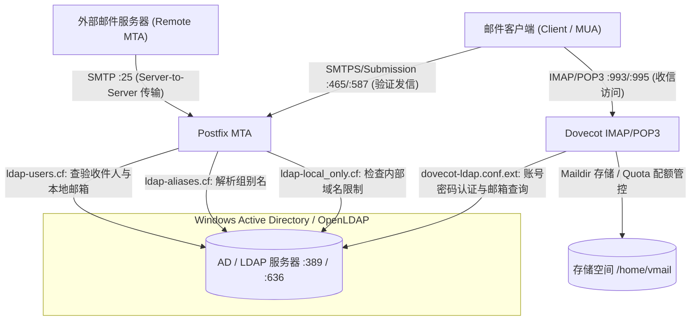
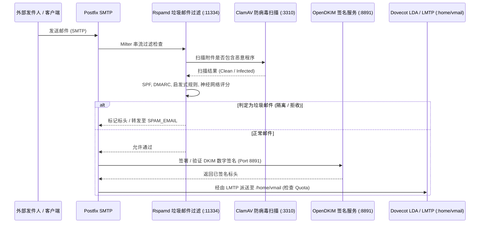
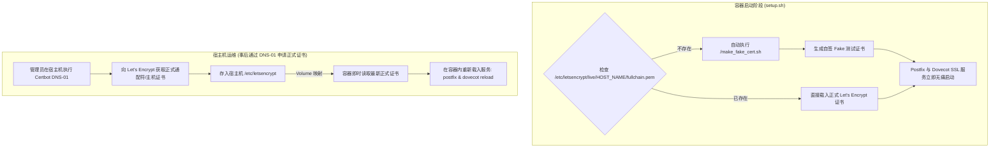
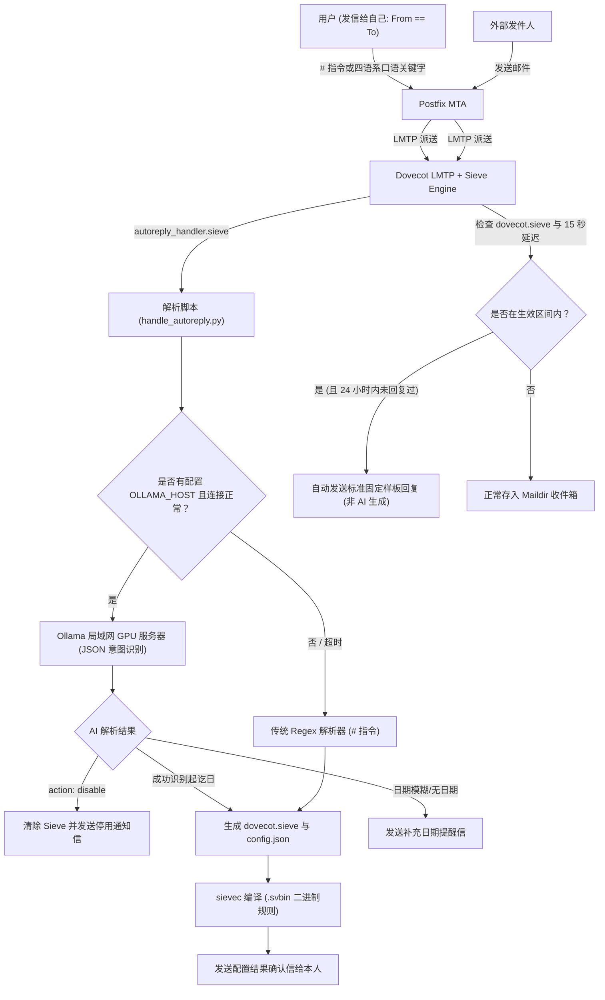
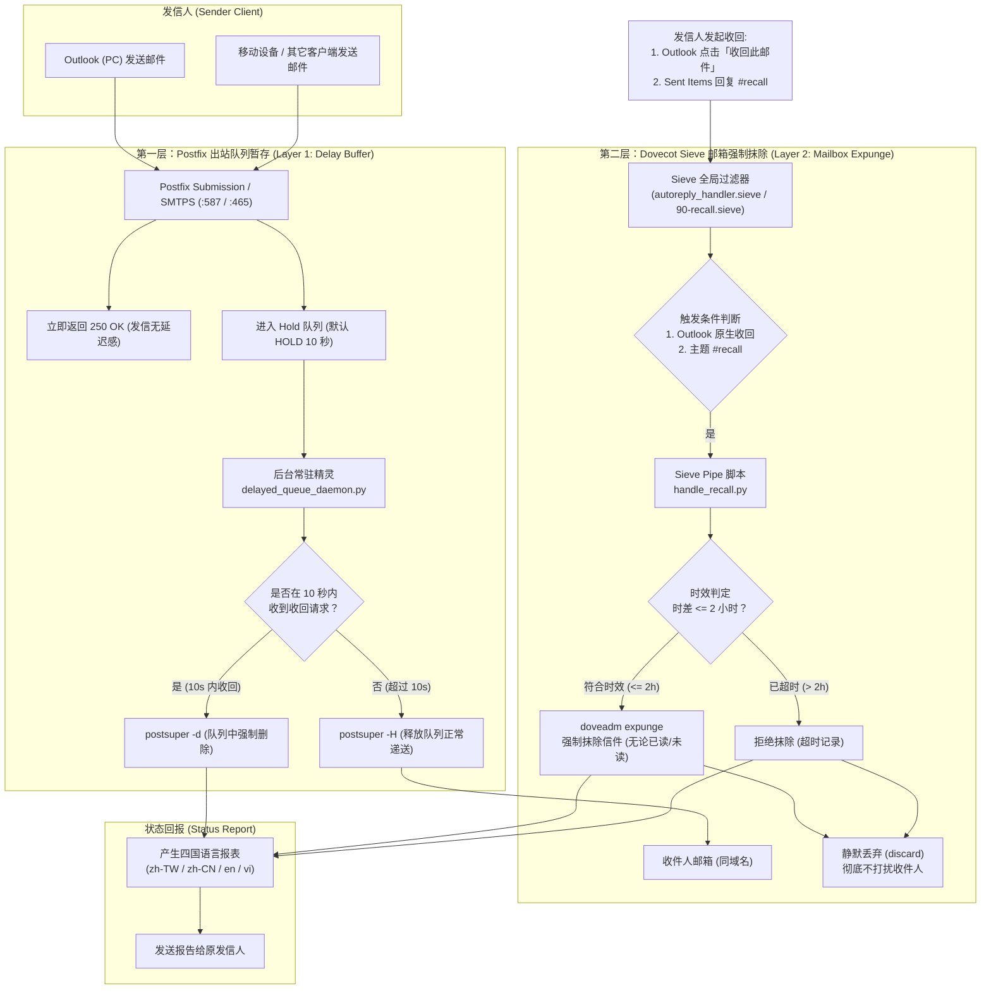

# 系统架构与技术运维指南

🌐 **Language / 語言 / Ngôn ngữ**:  
[English](ARCHITECTURE.md) | [繁體中文](ARCHITECTURE.zh-TW.md) | [简体中文](ARCHITECTURE.zh-CN.md) | [Tiếng Việt](ARCHITECTURE.vi.md)

---

## 📌 简介
本文档提供 **docker-Postfix-AD** 容器技术架构的深度剖析。详细说明 Postfix、Dovecot、微软 Active Directory (LDAP)、Rspamd、ClamAV、OpenDKIM 以及 SSL/TLS 证书体系之间的协同运行流程。

- **项目主页**: [README.zh-CN.md](README.zh-CN.md)
- **在线配置生成器**: [https://williamfromtw.github.io/docker-Postfix-AD/genLaunchCommand.html](https://williamfromtw.github.io/docker-Postfix-AD/genLaunchCommand.html)
- **在线互动架构图网页**: [https://williamfromtw.github.io/docker-Postfix-AD/architecture.html](https://williamfromtw.github.io/docker-Postfix-AD/architecture.html)

---

## 🏛️ 1. 全局架构与 Active Directory / LDAP 整合模型

本容器将 **Postfix** (MTA 传输代理) 与 **Dovecot** (IMAP/POP3 服务) 与 **微软 Windows Active Directory** 或 **OpenLDAP** 深度整合。连接默认采用标准 Port 389，并支持通过 `ENABLE_LDAPS=true` 切换为 Port 636 (LDAPS TLS 加密传输)。



### 📋 Active Directory (AD) / OpenLDAP 字段设置与验证规范
1. **账号验证强制使用纯账号（`sAMAccountName` / `uid`）**：
   - 用户在收发信软件（Outlook、Thunderbird、手机）设置账号时，**账号字段必须填写纯工号或 AD/LDAP 账号**（如 `520001` 或 `john`，全小写），**严格禁止使用含 `@域名` 或 Email 格式登录**。
2. **电子邮件地址（`mail` 属性）**：
   - 请于 AD/LDAP 用户属性中的 `mail` 字段填写完整的 Email 地址（例如 `john@smile.taipei`）。
   - 登录账号名称与电子邮件地址完全独立分离。外部来信会依据 `mail` 属性精准投递至 `/home/vmail/john@smile.taipei`。
3. **组别名（`ALIASES`）**：
   - 在 AD 创建“组”，并将别名 Email 填入组的 `mail` 属性（如 `sales@smile.taipei`），接着将成员账号加入该组即可。
4. **限制仅限本地域名收发（`local_only`）**：
   - 在 AD 用户或组的 `description` 属性填入 `local_only`。
   - Postfix 会阻断此账号对外部公网发信或收信，仅允许在内部域名互发。

---

## 🛡️ 2. 邮件安全过滤管道 (Postfix + Rspamd + ClamAV + OpenDKIM)

所有进出邮件均经过 Postfix 串接的 Milter 过滤链：



### 🔧 Rspamd Web 控制台与密码管理
- **Web UI 网址**: `http://<宿主机IP>:11334`
- **默认管理员密码**: `kafeiou.pw`
- **生成新加密密码哈希**:
  ```bash
  docker exec -it mailserver rspamadm pw --encrypt -p <您的新密码>
  ```
  将生成的哈希字符串填入 `/etc/rspamd/local.d/worker-controller.inc`。
- **垃圾邮件转发 (`SPAM_EMAIL`)**:
  当设置了 `SPAM_EMAIL` 变量时，被判定为垃圾邮件隔离的信件会自动转发至指定邮箱（如 `spam@smile.taipei`）。
- **完整 Rspamd 配置指南**:
  关于黑白名单、关键字正则、危险后缀名与隔离邮件救援完整范例，请参阅专属的 **[Rspamd 防护指南 (RSPAMD.zh-CN.md)](RSPAMD.zh-CN.md)**。

---

## 🔐 3. SSL/TLS 证书架构与 Let's Encrypt 管理机制

容器具备**开箱即用**的自动补位机制，同时完美支持企业正式 Let's Encrypt 证书。



### 🚀 零配置即刻启动机制 (`make_fake_cert.sh`)
- 第一次启动容器时，若宿主机尚未挂载正式证书，容器内 `setup.sh` 会自动执行 `/make_fake_cert.sh ${HOST_NAME}`。
- 自动建立符合 Let's Encrypt 目录结构的自签证书（`cert.pem`, `privkey.pem`, `chain.pem`, `fullchain.pem`），让 Postfix 与 Dovecot 的 SSL/TLS 服务（Port 465, 587, 993, 995）正常启动而不崩溃。

### 🌐 通过宿主机 Certbot (DNS-01 挑战) 获取正式证书
因邮件服务器通常不建议对外开放 HTTP Port 80，强烈建议在 Docker 宿主机使用 **DNS-01 挑战**：

1. **宿主机安装 Certbot**:
   ```bash
   sudo apt install certbot  # Ubuntu / Debian
   # 或 sudo dnf install certbot  # RHEL / Rocky Linux
   ```

2. **通过 DNS 验证申请证书**:
   ```bash
   sudo certbot certonly --manual --preferred-challenges dns -d mail.smile.taipei -d smile.taipei
   ```
   依提示至您的 DNS 托管商添加 `_acme-challenge` TXT 记录。

3. **重新载入容器服务**:
   证书生成于宿主机 `/etc/letsencrypt/live/mail.smile.taipei/` 后，直接在容器内重新载入：
   ```bash
   docker exec -it mailserver postfix reload
   docker exec -it mailserver dovecot reload
   ```

---

## 🔑 4. DKIM 与 SPF 数字安全配置手册

### 1. 在容器内启用 OpenDKIM
1. 进入容器内部：
   ```bash
   docker exec -it mailserver bash
   ```
2. 取消 `/etc/postfix/main.cf` 中的 milter 注释：
   ```text
   smtpd_milters = inet:127.0.0.1:8891
   non_smtpd_milters = $smtpd_milters
   milter_default_action = accept
   ```
3. 重新载入 Postfix：
   ```bash
   postfix reload
   ```

### 2. 批量生成多域名 DKIM 密钥 (`/getOpenDKIM.sh`)
1. 编辑 `/getOpenDKIM.sh` 填入您的域名名称：
   ```bash
   domains=( 
     'smile.taipei'
     'example2.com'
   )
   ```
2. 执行脚本：
   ```bash
   /getOpenDKIM.sh
   ```
3. 生成的公钥内容将存放于 `/etc/opendkim/keys/<域名>/default.txt`。

### 3. DNS TXT 记录配置示例
请在您的 DNS 管理界面添加以下记录：

#### A. SPF 记录 (域名主记录 `@`)
```text
类型: TXT
主机: @ (或 smile.taipei)
值:   v=spf1 ip4:<您的服务器公网IP> mx ~all
```

#### B. DKIM 记录 (TXT 记录)
```text
类型: TXT
主机: default._domainkey
值:   v=DKIM1; k=rsa; p=<default.txt 内的公钥字符串>
```

#### C. DMARC 记录 (TXT 记录)
```text
类型: TXT
主机: _dmarc
值:   v=DMARC1; p=quarantine; rua=mailto:postmaster@smile.taipei
```

---

## 🤖 5. Email 驱动之智能自动回复 (Auto-Reply / Vacation Responder)

针对无 Webmail 前端界面的环境，本项目提供独创的 **Email-Driven 智能自动回复与休假应答系统**（由 Postfix LMTP、Dovecot Pigeonhole Sieve 与 Sieve Extprograms 驱动）。



### 📩 如何启用 / 停用自动回复

用户只需在任何电脑或手机邮件 App 中**发一封信给自己（From == To）**：

#### 0. 🤖 局域网独立 GPU Ollama 本地端 AI 口语请假模式 (支持 4 语系)
当环境变量配置了 `OLLAMA_HOST`（例如：`http://192.168.1.100:11434`）且 AI 服务正常时，用户可直接随手用日常口语发信给自己：
- **简体中文**：主题填写“`我下周一到周三出差北京`”、“`明天请假一天`”
- **繁体中文**：主题填写“`我下週三到五休假去日本`”、“`明天下午請假去看牙醫`”
- **越南文**：主题填写“`Tôi xin nghỉ phép từ thứ 4 đến thứ 6 tuần sau`”、“`Ngày mai tôi đi công tác`”
- **英文**：主题填写“`Out of office until next Monday`”、“`I will be on vacation tomorrow`”
- **口头销假 / 取消回复**：随手发信“`我销假了`”、“`取消这次休假`”、“`Tôi đã đi làm lại`”或“`Cancel out of office`”，系统立即停用自动回信！
- **零 AI 幻觉保障**：AI 仅负责解析时间区间与意图，对外自动回复邮件坚持采用企业标准样板（若信件正文有撰写代理人信息，则采用撰写内容）。
- **平滑降级保护**：若 GPU 主机离线或超时（默认 5 秒），自动降级回传统 Regex 处理；纯口语时主动发信提醒用户改用 `#autoreply`。

##### ⚙️ 如何更换 Ollama 模型与环境变量配置
您可以随时更换 Ollama 运行的模型（例如换成 `qwen2.5:7b`、`qwen2.5:3b` 或 `qwen3.6:27b-q8_0`），只需在 `docker-compose.yaml` 或容器启动参数中指定：

| 环境变量 | 默认值 | 说明 |
| :--- | :--- | :--- |
| `OLLAMA_HOST` | *(未配置)* | Ollama API 地址（如 `http://10.192.130.184:11434`） |
| `OLLAMA_MODEL` | *(未配置 / 自动探测)* | **欲使用的模型名称**（例如 `qwen3.8-200k:latest`、`qwen2.5:7b`）。无写死默认值，未填写时系统将自动连线 Ollama 探测当前运行或已下载模型。 |
| `OLLAMA_TIMEOUT` | `180` | 超时时间（秒，默认 180 秒）。即使为 CPU 运算或 27B 大模型亦有充分时间推理。 |

* **模型推荐**：
  * **GPU 首选 `qwen3.8-200k:latest` 或 `qwen2.5:7b`**：GPU 显存全载入，推理约 1~3 秒，4 语系日期解析极为精准。
  * **轻量首选 `qwen2.5:3b`**：约 1.9 GB，即使服务器无 GPU 纯 CPU 运算，亦能在 1~2 秒内完成解析。
  * **大模型与纯 CPU 运算**：默认的 180 秒超时保护机制可确保 27B 等大模型或 CPU 运算能完整执行推理完毕。

#### 1. 指定日期区间（传统 `#` 指令模式，默认时区：UTC+8 台北时间）
- **收件人**：自己 (`your_email@example.com`)
- **主题**：`#autoreply 2026-08-25 ~ 2026-08-30 外出开会 / 休假`（亦支持 `#vacation`、`#休假`、`#不在`、`#出差`、`#请假`）
- **正文**：填写您要回复给对方的邮件内容（可自定义职务代理人、紧急电话等）。
- *系统将于 2026-08-25 00:00:00 自动生效，并于 2026-08-30 23:59:59 (UTC+8) 自动过期失效，完全无需手动关闭。*

#### 2. 常开模式（直到手动关闭）
- **主题**：`#autoreply on 出差中`
- **正文**：自定义回复内容。

#### 3. 立即停用 / 取消
- **主题**：`#autoreply off`（或 `#autoreply cancel`、`#autoreply 停用`）

#### 4. 即时确认信与防洗版保护
- 配置成功或取消后，系统会在数秒内**自动回发确认信**给用户本人，清楚列出生效区间与回复内容预览。
- **防洗版机制 (`:days 1`)**：同一外部发件人在 24 小时内发送多封邮件时，Sieve 最多仅会回复 1 次，彻底避免邮件循环与轰炸。

---

## ⚡ 6. 性能调优、日志检查与 Fail2ban 实务

### 1. Fail2ban 与真实 IP 获取
为了让宿主机上的 fail2ban 能直接读取 `/var/log/maillog` 进行阻断，强烈建议启动容器时使用 **`--net=host`**（或 Compose 中的 `network_mode: host`）。

### 2. 容器重要调优配置文件
- `/etc/dovecot/conf.d/10-auth.conf`（缓存容量与性能优化）
- `/etc/dovecot/conf.d/10-master.conf`（VSZ 内存限制）
- `/etc/dovecot/conf.d/90-quota.conf`（默认邮箱配额规则）

### 3. 服务健康检查与排错命令
```bash
# 检查 supervisor 管理的所有子服务状态
docker exec -it mailserver supervisorctl status

# 测试本机 Port 监听状态
docker exec -it mailserver telnet localhost 25    # Postfix SMTP
docker exec -it mailserver telnet localhost 143   # Dovecot IMAP
docker exec -it mailserver telnet localhost 8891  # OpenDKIM
docker exec -it mailserver telnet localhost 11334 # Rspamd
docker exec -it mailserver telnet localhost 12340 # Quota 服务
```

---

## 📬 7. 企业级双层邮件收回系统 (Two-Tier Message Recall System)

本系统具备原生相容 Microsoft Outlook「收回此邮件」与移动设备 `#recall` 回复之企业级双层收回机制，解决传统 IMAP 无法收回邮件与造成收件者好奇点阅之历史痛点。

### 🔄 系统架构流程图



### 🎯 双层核心运作原理

1. **第一层：出站队列暂存缓冲 (Layer 1 Delay Buffer)**：
   - 凡通过认证 Port 587 (Submission) 或 Port 465 (SMTPS) 发送的邮件，Postfix 会立即回应 `250 OK: queued` 给发件人，并将邮件暂留于 Hold 队列 `RECALL_DELAY_SECONDS`（默认 10 秒）。
   - 若发件人在 10 秒内发起收回，系统通过 `postsuper -d` 直接在队列中销毁邮件，内部同事与外部收件人均不会收到任何邮件。
   - 若 10 秒内未收回，后台精灵 `delayed_queue_daemon.py` 自动执行 `postsuper -H` 放行邮件正常递送。
   - **0 延迟旁路**：若管理员设置 `RECALL_DELAY_SECONDS=0`，系统自动切换为 direct bypass，出站邮件直接即时发出，完全不进入 Hold 队列。

2. **第二层：同域名邮箱强制抹除 (Layer 2 Forced Expunge)**：
   - 当邮件已送达同域名内部邮箱，在 `RECALL_MAX_HOURS`（默认 2 小时）时限内发起收回，系统通过 `doveadm expunge` 锁定 Message-ID 强制抹除该邮件。
   - **已读/未读一律抹除**：无论收件人是否已开启或点阅过（`SEEN`），邮件一律自邮箱中彻底移除。
   - **收回通知信彻底静默**：系统自动拦截并丢弃 Outlook 产生的收回收信（`discard`），收件人完全不会收到任何尴尬通知。
   - **时效逾期保护**：超过 2 小时之收回请求将被系统拒绝，且维持静默不打扰收件人。
   - **外部收件人保护**：对已出站之外部收件人（如 Gmail 等），系统会拦截对外发送的收回通知，并于回报中提示外部邮箱无法强制抹除。

### 📱 双轨发起收回方式

| 客户端环境 | 操作方式 | 辨识机制 |
| :--- | :--- | :--- |
| **PC 端 Microsoft Outlook** | 打开已发送邮件，点击菜单「文件」/「动作」➜ **「收回此邮件」** | 辨识 `X-MS-Exchange-Organization-Recall-Action` 标头或 `Recall:`/`撤回:` 主题 |
| **手机端 / Webmail (iOS, Android, 网页邮件)** | 前往「已发送邮件 (Sent Items)」，点击该邮件**回复 (Reply)**，于**主题开头加上 `#recall`** 发送 | 通过 `In-Reply-To` / `References` 标头锁定原始 Message-ID |

### 🛠️ 容器内部参数调整指南 (`/etc/dovecot/recall.env`)

本功能之参数存放在容器内部配置文件，网页生成器维持简洁不变。若需调整时限或关闭功能，管理员可随时 `docker exec` 进入修改：

```bash
# 进入容器
docker exec -it mailserver vi /etc/dovecot/recall.env
```

文件默认内容：
```ini
ENABLE_RECALL="yes"        # 是否启用收回系统 (yes / no)
RECALL_DELAY_SECONDS=10    # 第一层队列暂存秒数 (设为 0 代表直接直发，完全关闭暂存)
RECALL_MAX_HOURS=2         # 第二层同域名强制抹除有效时限 (小时)
```
修改存盘后，后台守护进程与 Sieve 脚本会**自动即时重新读取生效**，无需重启容器。

### 💡 协议特性与注意事项 (POP3 vs IMAP)

- **IMAP / Webmail 客户端**：双向即时同步，服务器执行 `doveadm expunge` 后，收件人屏幕上的邮件会立即消失。
- **POP3 客户端**：
  - 第一层 10 秒暂存期间，邮件尚未进邮箱，POP3 绝对收不到（100% 成功拦截）。
  - 若已超过暂存期且对方已使用 POP3 将邮件收取下载至本地电脑硬盘（.pst 文件），服务器端会抹除备份，但无法远程删除其电脑本地文件（此时系统会在收回报告中向发件人备注说明）。

