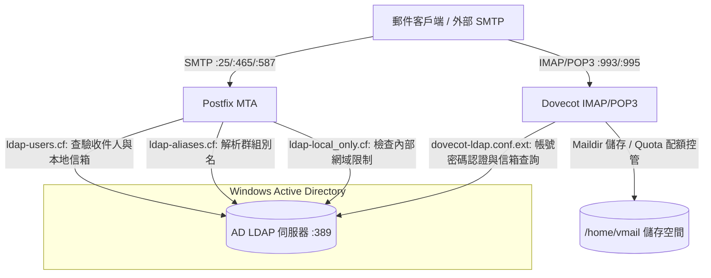
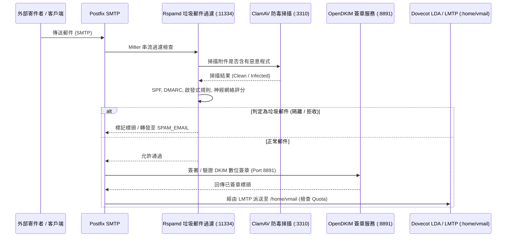

# 系統架構與技術維運指南

🌐 **Language / 語言 / Ngôn ngữ**:  
[English](ARCHITECTURE.md) | [繁體中文](ARCHITECTURE.zh-TW.md) | [简体中文](ARCHITECTURE.zh-CN.md) | [Tiếng Việt](ARCHITECTURE.vi.md)

---

## 📌 簡介
本文件提供 **docker-Postfix-AD** 容器技術架構的深度剖析。詳細說明 Postfix、Dovecot、微軟 Active Directory (LDAP)、Rspamd、ClamAV、OpenDKIM 以及 SSL/TLS 憑證體系之間的協同運作流程。

- **專案首頁**: [README.zh-TW.md](README.zh-TW.md)
- **線上設定產生器**: [https://williamfromtw.github.io/docker-Postfix-AD/genLaunchCommand.html](https://williamfromtw.github.io/docker-Postfix-AD/genLaunchCommand.html)
- **線上互動架構圖網頁**: [https://williamfromtw.github.io/docker-Postfix-AD/architecture.html](https://williamfromtw.github.io/docker-Postfix-AD/architecture.html)

---

## 🏛️ 1. 全域架構與 Active Directory (LDAP) 整合模型

本容器將 **Postfix** (MTA 傳輸代理) 與 **Dovecot** (IMAP/POP3 服務) 透過 LDAP 協定（Port 389）直接與 **微軟 Windows Active Directory** 深度整合。



### 📋 Active Directory (AD) 欄位設定規範
1. **帳號名稱必須為小寫**：
   - AD 中的使用者登入帳號（sAMAccountName）**必須建立為全小寫**（如 `520001` 或 `john`），因為 Dovecot 查詢時固定會轉為小寫送出查詢。
2. **電子郵件地址（`mail` 屬性）**：
   - 請於 AD 使用者屬性中的 `mail` 欄位填寫完整的 Email 地址（例如 `john@smile.taipei`）。
   - 登入帳號名稱可與電子郵件地址完全不同。
3. **群組別名（`ALIASES`）**：
   - 在 AD 建立「群組」，並將別名 Email 填入群組的 `mail` 屬性（如 `sales@smile.taipei`），接著將成員帳號加入此群組即可。
4. **限制僅限本地網域寄收（`local_only`）**：
   - 在 AD 使用者或群組的 `description` 屬性填入 `local_only`。
   - Postfix 會阻擋此帳號對外部公網寄信或收信，僅允許在內部網域互寄。

---

## 🛡️ 2. 郵件安全過濾管道 (Postfix + Rspamd + ClamAV + OpenDKIM)

所有進出郵件皆經過 Postfix 串接的 Milter 過濾鏈：



### 🔧 Rspamd Web 控制台與密碼管理
- **Web UI 網址**: `http://<宿主機IP>:11334`
- **預設管理員密碼**: `kafeiou.pw`
- **產生新加密密碼雜湊**:
  ```bash
  docker exec -it mailserver rspamadm pw --encrypt -p <您的新密碼>
  ```
  將產出的雜湊字串貼入 `/etc/rspamd/local.d/worker-controller.inc`。
- **垃圾郵件轉發 (`SPAM_EMAIL`)**:
  當設定了 `SPAM_EMAIL` 變數時，被判定為垃圾郵件隔離的信件會自動轉發至指定信箱（如 `spam@smile.taipei`）。

---

## 🔐 3. SSL/TLS 憑證架構與 Let's Encrypt 管理機制

容器具備**開箱即用**的自動補位機制，同時完美支援企業正式 Let's Encrypt 憑證。

```mermaid
graph TD
    subgraph 容器啟動階段 (setup.sh)
        A{檢查 /etc/letsencrypt/live/HOST_NAME/fullchain.pem}
        A -->|不存在| B[自動執行 /make_fake_cert.sh]
        B --> C[產生自簽 Fake 測試憑證]
        C --> D[Postfix 與 Dovecot SSL 服務立即無痛啟動]
        A -->|已存在| E[直接載入正式 Let's Encrypt 憑證]
        E --> D
    end

    subgraph 宿主機維運 (事後透過 DNS-01 申請正式憑證)
        F[管理者於宿主機執行 Certbot DNS-01] --> G[向 Let's Encrypt 取得正式萬用/主機憑證]
        G --> H[存入宿主機 /etc/letsencrypt]
        H -->|Volume 映射| I[容器即時讀取最新正式憑證]
        I --> J[於容器內重新載入服務: postfix & dovecot reload]
    end
```

### 🚀 零設定即刻啟動機制 (`make_fake_cert.sh`)
- 第一次啟動容器時，若宿主機尚未掛載正式憑證，容器內 `setup.sh` 會自動執行 `/make_fake_cert.sh ${HOST_NAME}`。
- 自動建立符合 Let's Encrypt 目錄結構的自簽憑證（`cert.pem`, `privkey.pem`, `chain.pem`, `fullchain.pem`），讓 Postfix 與 Dovecot 的 SSL/TLS 服務（Port 465, 587, 993, 995）正常啟動而不崩潰。

### 🌐 透過宿主機 Certbot (DNS-01 挑戰) 取得正式憑證
因郵件伺服器通常不建議對外開放 HTTP Port 80，強烈建議在 Docker 宿主機使用 **DNS-01 挑戰**：

1. **宿主機安裝 Certbot**:
   ```bash
   sudo apt install certbot  # Ubuntu / Debian
   # 或 sudo dnf install certbot  # RHEL / Rocky Linux
   ```

2. **透過 DNS 驗證申請憑證**:
   ```bash
   sudo certbot certonly --manual --preferred-challenges dns -d mail.smile.taipei -d smile.taipei
   ```
   依畫面提示至您的 DNS 代管商新增 `_acme-challenge` TXT 記錄。

3. **重新載入容器服務**:
   憑證生成於宿主機 `/etc/letsencrypt/live/mail.smile.taipei/` 後，直接在容器內重新載入：
   ```bash
   docker exec -it mailserver postfix reload
   docker exec -it mailserver dovecot reload
   ```

---

## 🔑 4. DKIM 與 SPF 數位安全設定手冊

### 1. 於容器內啟用 OpenDKIM
1. 進入容器內部：
   ```bash
   docker exec -it mailserver bash
   ```
2. 取消 `/etc/postfix/main.cf` 中的 milter 註解：
   ```text
   smtpd_milters = inet:127.0.0.1:8891
   non_smtpd_milters = $smtpd_milters
   milter_default_action = accept
   ```
3. 重新載入 Postfix：
   ```bash
   postfix reload
   ```

### 2. 批次產生多網域 DKIM 金鑰 (`/getOpenDKIM.sh`)
1. 編輯 `/getOpenDKIM.sh` 填入您的網域名稱：
   ```bash
   domains=( 
     'smile.taipei'
     'example2.com'
   )
   ```
2. 執行腳本：
   ```bash
   /getOpenDKIM.sh
   ```
3. 產生的公鑰內容將存於 `/etc/opendkim/keys/<網域>/default.txt`。

### 3. DNS TXT 記錄配置範例
請在您的 DNS 管理介面新增以下記錄：

#### A. SPF 記錄 (網域主記錄 `@`)
```text
類型: TXT
主機: @ (或 smile.taipei)
值:   v=spf1 ip4:<您的伺服器公網IP> mx ~all
```

#### B. DKIM 記錄 (TXT 記錄)
```text
類型: TXT
主機: default._domainkey
值:   v=DKIM1; k=rsa; p=<default.txt 內的公鑰字串>
```

#### C. DMARC 記錄 (TXT 記錄)
```text
類型: TXT
主機: _dmarc
值:   v=DMARC1; p=quarantine; rua=mailto:postmaster@smile.taipei
```

---

## ⚡ 5. 效能調校、日誌檢視與 Fail2ban 實務

### 1. Fail2ban 與真實 IP 取得
為了讓宿主機上的 fail2ban 能直接讀取 `/var/log/maillog` 進行阻擋，強烈建議啟動容器時使用 **`--net=host`**（或 Compose 中的 `network_mode: host`）。

### 2. 容器重要調校設定檔
- `/etc/dovecot/conf.d/10-auth.conf`（快取容量與效能優化）
- `/etc/dovecot/conf.d/10-master.conf`（VSZ 記憶體限制）
- `/etc/dovecot/conf.d/90-quota.conf`（預設信箱配額規則）

### 3. 服務健康檢查與除錯指令
```bash
# 檢查 supervisor 管理的所有子服務狀態
docker exec -it mailserver supervisorctl status

# 測試本機 Port 監聽狀態
docker exec -it mailserver telnet localhost 25    # Postfix SMTP
docker exec -it mailserver telnet localhost 143   # Dovecot IMAP
docker exec -it mailserver telnet localhost 8891  # OpenDKIM
docker exec -it mailserver telnet localhost 11334 # Rspamd
docker exec -it mailserver telnet localhost 12340 # Quota 服務
```
