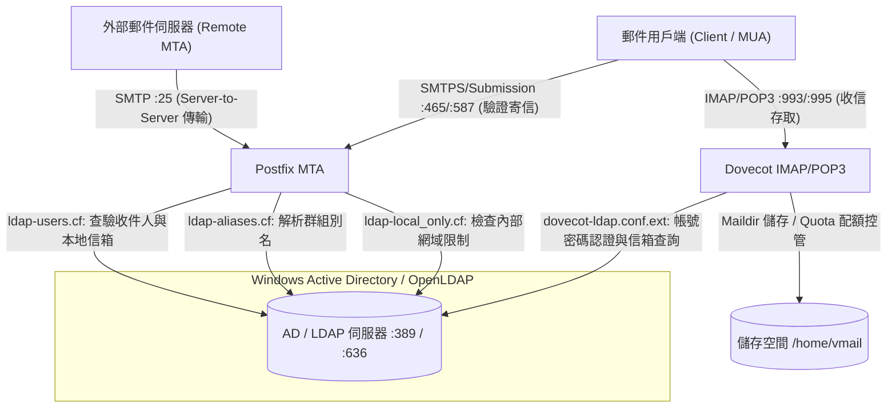
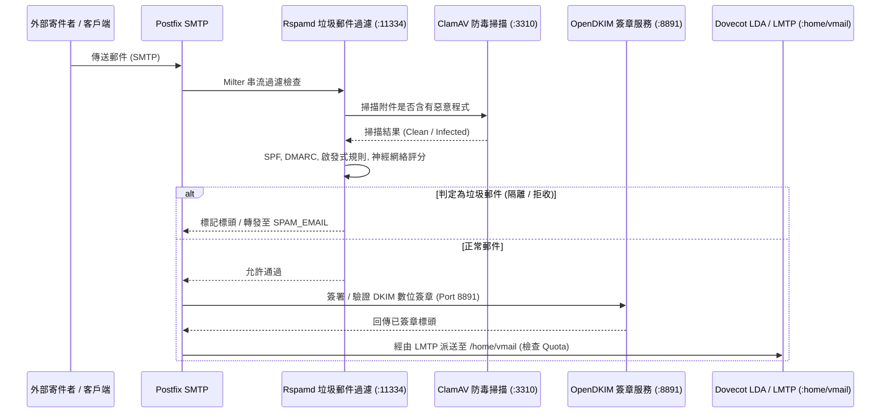
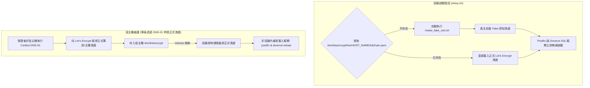
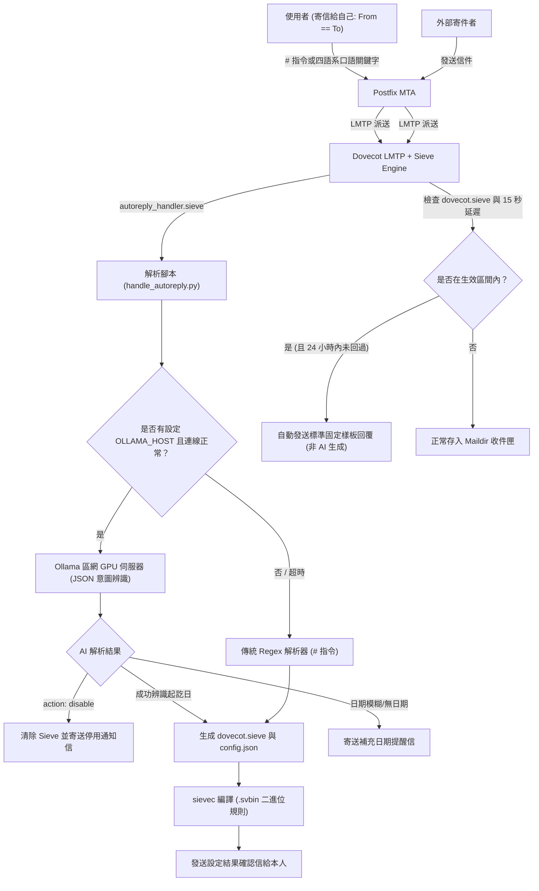

# 系統架構與技術維運指南

🌐 **Language / 語言 / Ngôn ngữ**:  
[English](ARCHITECTURE.md) | [繁體中文](ARCHITECTURE.zh-TW.md) | [简体中文](ARCHITECTURE.zh-CN.md) | [Tiếng Việt](ARCHITECTURE.vi.md)

---

## 📌 簡介
本文件提供 **docker-Postfix-AD** 容器技術架構的深度剖析。詳細說明 Postfix、Dovecot、微軟 Active Directory (LDAP)、Rspamd、ClamAV、OpenDKIM 以及 SSL/TLS 憑證體系之間的協同運作流程。

- **專案首頁**: [README.zh-TW.md](README.zh-TW.md)
- **線上設定產生器**: [https://williamfromtw.github.io/docker-Postfix-AD/genLaunchCommand.html](https://williamfromtw.github.io/docker-Postfix-AD/genLaunchCommand.html)
- **線上互動架構圖網頁**: [https://williamfromtw.github.io/docker-Postfix-AD/architecture.html](https://williamfromtw.github.io/docker-Postfix-AD/architecture.html)

---

## 🏛️ 1. 全域架構與 Active Directory / LDAP 整合模型

本容器將 **Postfix** (MTA 傳輸代理) 與 **Dovecot** (IMAP/POP3 服務) 與 **微軟 Windows Active Directory** 或 **OpenLDAP** 深度整合。連線預設採用標準 Port 389，並支援透過 `ENABLE_LDAPS=true` 切換為 Port 636 (LDAPS TLS 加密傳輸)。



### 📋 Active Directory (AD) / OpenLDAP 欄位設定與驗證規範
1. **帳號驗證強制使用純帳號（`sAMAccountName` / `uid`）**：
   - 使用者在收發信軟體（Outlook、Thunderbird、手機）設定帳號時，**帳號欄位必須填寫純工號或 AD/LDAP 帳號**（如 `520001` 或 `john`，全小寫），**嚴格禁止使用含 `@網域` 或 Email 格式登入**。
2. **電子郵件地址（`mail` 屬性）**：
   - 請於 AD/LDAP 使用者屬性中的 `mail` 欄位填寫完整的 Email 地址（例如 `john@smile.taipei`）。
   - 登入帳號名稱與電子郵件地址完全獨立分離。外部來信會依據 `mail` 屬性精準投遞至 `/home/vmail/john@smile.taipei`。
3. **群組別名（`ALIASES`）**：
   - 在 AD 建立「群組」，並將別名 Email 填入群組的 `mail` 屬性（如 `sales@smile.taipei`），接著將成員帳號加入此群組即可。
4. **限制僅限本地網域寄收（`local_only`）**：
   - 在 AD 使用者或群組的 `description` 屬性填入 `local_only`。
   - Postfix 會阻擋此帳號對外部公網寄信或收信，僅允許在內部網域互寄。

---

## 🛡️ 2. 郵件安全過濾管道 (Postfix + Rspamd + ClamAV + OpenDKIM)

所有進出郵件皆經過 Postfix 串接的 Milter 過濾鏈：



### 🔧 Rspamd Web 控制台與密碼管理
- **Web UI 網址**: `http://<宿主機IP>:11334`
- **預設管理員密碼**: `kafeiou.pw`
- **產生新加密密碼雜湊**:
  ```bash
  docker exec -it mailserver rspamadm pw --encrypt -p <您的新密碼>
  ```
  將產出的雜湊字串貼入 `/etc/rspamd/local.d/worker-controller.inc`。
- **垃圾郵件轉發 (`SPAM_EMAIL`)**:
  當設定了 `SPAM_EMAIL` 變數時，被判定為垃圾郵件隔離的信件會自動轉發至指定信箱（如 `spam@smile.taipei`）。
- **完整 Rspamd 設定指南**:
  關於黑白名單、關鍵字正則、危險副檔名與隔離郵件救援完整範例，請參閱專屬的 **[Rspamd 防護指南 (RSPAMD.zh-TW.md)](RSPAMD.zh-TW.md)**。

---

## 🔐 3. SSL/TLS 憑證架構與 Let's Encrypt 管理機制

容器具備**開箱即用**的自動補位機制，同時完美支援企業正式 Let's Encrypt 憑證。



### 🚀 零設定即刻啟動機制 (`make_fake_cert.sh`)
- 第一次啟動容器時，若宿主機尚未掛載正式憑證，容器內 `setup.sh` 會自動執行 `/make_fake_cert.sh ${HOST_NAME}`。
- 自動建立符合 Let's Encrypt 目錄結構的自簽憑證（`cert.pem`, `privkey.pem`, `chain.pem`, `fullchain.pem`），讓 Postfix 與 Dovecot 的 SSL/TLS 服務（Port 465, 587, 993, 995）正常啟動而不崩潰。

### 🌐 透過宿主機 Certbot (DNS-01 挑戰) 取得正式憑證
因郵件伺服器通常不建議對外開放 HTTP Port 80，強烈建議在 Docker 宿主機使用 **DNS-01 挑戰**：

1. **宿主機安裝 Certbot**:
   ```bash
   sudo apt install certbot  # Ubuntu / Debian
   # 或 sudo dnf install certbot  # RHEL / Rocky Linux
   ```

2. **透過 DNS 驗證申請憑證**:
   ```bash
   sudo certbot certonly --manual --preferred-challenges dns -d mail.smile.taipei -d smile.taipei
   ```
   依畫面提示至您的 DNS 代管商新增 `_acme-challenge` TXT 記錄。

3. **重新載入容器服務**:
   憑證生成於宿主機 `/etc/letsencrypt/live/mail.smile.taipei/` 後，直接在容器內重新載入：
   ```bash
   docker exec -it mailserver postfix reload
   docker exec -it mailserver dovecot reload
   ```

---

## 🔑 4. DKIM 與 SPF 數位安全設定手冊

### 1. 於容器內啟用 OpenDKIM
1. 進入容器內部：
   ```bash
   docker exec -it mailserver bash
   ```
2. 取消 `/etc/postfix/main.cf` 中的 milter 註解：
   ```text
   smtpd_milters = inet:127.0.0.1:8891
   non_smtpd_milters = $smtpd_milters
   milter_default_action = accept
   ```
3. 重新載入 Postfix：
   ```bash
   postfix reload
   ```

### 2. 批次產生多網域 DKIM 金鑰 (`/getOpenDKIM.sh`)
1. 編輯 `/getOpenDKIM.sh` 填入您的網域名稱：
   ```bash
   domains=( 
     'smile.taipei'
     'example2.com'
   )
   ```
2. 執行腳本：
   ```bash
   /getOpenDKIM.sh
   ```
3. 產生的公鑰內容將存於 `/etc/opendkim/keys/<網域>/default.txt`。

### 3. DNS TXT 記錄配置範例
請在您的 DNS 管理介面新增以下記錄：

#### A. SPF 記錄 (網域主記錄 `@`)
```text
類型: TXT
主機: @ (或 smile.taipei)
值:   v=spf1 ip4:<您的伺服器公網IP> mx ~all
```

#### B. DKIM 記錄 (TXT 記錄)
```text
類型: TXT
主機: default._domainkey
值:   v=DKIM1; k=rsa; p=<default.txt 內的公鑰字串>
```

#### C. DMARC 記錄 (TXT 記錄)
```text
類型: TXT
主機: _dmarc
值:   v=DMARC1; p=quarantine; rua=mailto:postmaster@smile.taipei
```

---

## 🤖 5. Email 驅動之智慧自動回覆 (Auto-Reply / Vacation Responder)

針對無 Webmail 前端介面的環境，本專案提供獨創的 **Email-Driven 智慧自動回信與休假應答系統**（由 Postfix LMTP、Dovecot Pigeonhole Sieve 與 Sieve Extprograms 驅動）。



### 📩 如何啟用 / 停用自動回覆

使用者只需在任何電腦或手機郵件 App 中**寄一封信給自己（From == To）**：

#### 0. 🤖 區網獨立 GPU Ollama 本機端 AI 口語請假模式 (支援 4 語系)
當環境變數設定了 `OLLAMA_HOST`（例如：`http://192.168.1.100:11434`）且 AI 服務正常時，同仁可直接隨手用日常口語發信給自己：
- **繁體中文**：主旨填寫「`我下週三到五休假去日本`」、「`明天下午請假去看牙醫`」
- **簡體中文**：主旨填寫「`我下周一到周三出差北京`」、「`明天请假一天`」
- **越南文**：主旨填寫「`Tôi xin nghỉ phép từ thứ 4 đến thứ 6 tuần sau`」、「`Ngày mai tôi đi công tác`」
- **英文**：主旨填寫「`Out of office until next Monday`」、「`I will be on vacation tomorrow`」
- **口頭銷假 / 取消回覆**：隨手發信「`我銷假了`」、「`取消這次休假`」、「`Tôi đã đi làm lại`」或「`Cancel out of office`」，系統立即停用自動回信！
- **零 AI 幻覺保障**：AI 僅負責解析時間區間與意圖，對外自動回覆信件堅持採用公司標準樣板（若同仁信件內文有撰寫代理人資訊，則採用同仁撰寫內容）。
- **無縫降級保護**：若 GPU 主機離線或超時（預設 5 秒），自動降級回傳統 Regex 處理；純口語時主動寄信提醒同仁改用 `#autoreply`。

##### ⚙️ 如何更換 Ollama 模型與環境變數設定
您可以隨時更換 Ollama 執行的模型（例如換成 `qwen2.5:7b`、`qwen2.5:3b` 或 `qwen3.6:27b-q8_0`），只需在 `docker-compose.yaml` 或容器啟動參數中指定：

| 環境變數 | 預設值 | 說明 |
| :--- | :--- | :--- |
| `OLLAMA_HOST` | *(未設定)* | Ollama API 位址（如 `http://10.192.130.184:11434`） |
| `OLLAMA_MODEL` | `qwen2.5:7b` | **欲使用的模型名稱**（例如切換為 `qwen2.5:3b` 或 `qwen3.6:27b-q8_0`） |
| `OLLAMA_TIMEOUT` | `5` | 超時時間（秒）。若模型較大或純 CPU 運算，建議提高為 `60`~`180` |

* **模型推薦**：
  * **首選推薦 `qwen2.5:7b`**：約 4.7 GB，8GB 顯存即可全載入，推論 < 1 秒，4 語系日期解析極為精準。
  * **輕量首選 `qwen2.5:3b`**：約 1.9 GB，即使伺服器無 GPU 純 CPU 運算，亦能在 1~2 秒內完成解析。
  * **超大模型注意事項**：若使用 `27b` 等超大模型且未載入顯存（純 CPU 運算），單次推論可能耗時 1~3 分鐘，務必將 `OLLAMA_TIMEOUT` 設為 `150` 以上以避免超時。

#### 1. 指定日期區間（傳統 `#` 指令模式，預設時區：台灣 UTC+8 台北時間）
- **收件人**：自己 (`your_email@example.com`)
- **主旨**：`#autoreply 2026-08-25 ~ 2026-08-30 外出開會 / 休假`（亦支援 `#vacation`、`#休假`、`#不在`、`#出差`、`#請假`）
- **內文**：填寫您要回覆給對方的信件內容（可自訂職務代理人、緊急電話等）。
- *系統將於 2026-08-25 00:00:00 自動生效，並於 2026-08-30 23:59:59 (UTC+8) 自動過期失效，完全無需手動關閉。*

#### 2. 常開模式（直到手動關閉）
- **主旨**：`#autoreply on 出差中`
- **內文**：自訂回信內容。

#### 3. 立即停用 / 取消
- **主旨**：`#autoreply off`（或 `#autoreply cancel`、`#autoreply 停用`）

#### 4. 即時確認信與防洗版保護
- 設定成功或取消後，系統會在數秒內**自動回寄確認信**給使用者本人，清楚列出生效區間與回信內文預覽。
- **防洗版機制 (`:days 1`)**：同一外部寄件者在 24 小時內寄多封信時，Sieve 最多僅會回覆 1 次，徹底避免信件迴圈與轟炸。

---

## ⚡ 6. 效能調校、日誌檢視與 Fail2ban 實務

### 1. Fail2ban 與真實 IP 取得
為了讓宿主機上的 fail2ban 能直接讀取 `/var/log/maillog` 進行阻擋，強烈建議啟動容器時使用 **`--net=host`**（或 Compose 中的 `network_mode: host`）。

### 2. 容器重要調校設定檔
- `/etc/dovecot/conf.d/10-auth.conf`（快取容量與效能優化）
- `/etc/dovecot/conf.d/10-master.conf`（VSZ 記憶體限制）
- `/etc/dovecot/conf.d/90-quota.conf`（預設信箱配額規則）

### 3. 服務健康檢查與除錯指令
```bash
# 檢查 supervisor 管理的所有子服務狀態
docker exec -it mailserver supervisorctl status

# 測試本機 Port 監聽狀態
docker exec -it mailserver telnet localhost 25    # Postfix SMTP
docker exec -it mailserver telnet localhost 143   # Dovecot IMAP
docker exec -it mailserver telnet localhost 8891  # OpenDKIM
docker exec -it mailserver telnet localhost 11334 # Rspamd
docker exec -it mailserver telnet localhost 12340 # Quota 服務
```
