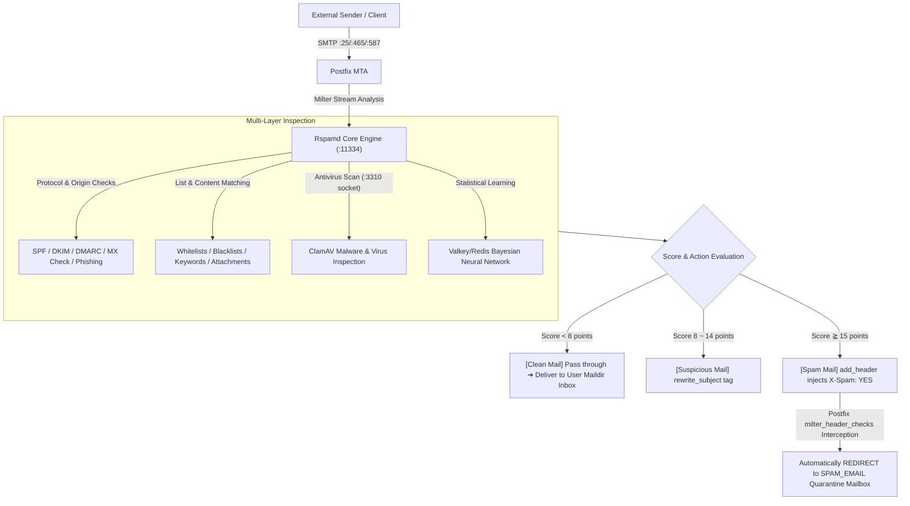

# 🛡️ Rspamd Mail Security & Web Management Guide

This project deeply integrates the high-performance **Rspamd Spam Filtering Engine**, **ClamAV Antivirus Scanning**, **Multi-dimensional Whitelists/Blacklists**, **Deep Archive Inspection**, and a **Zero-Bounce Quarantine (`SPAM_EMAIL`)** architecture to provide comprehensive enterprise email security.

---

## 🏛️ 1. System Filtering Architecture & Processing Flow



---

## 🌐 2. Web Management Console (Web UI)

Rspamd includes a modern Web UI providing real-time throughput metrics, online rule adjustments, map maintenance, and scan/learn tools.

### 🔑 Login Information & URL
- **Web UI URL**: `http://<SERVER_IP>:11334`
  > 💡 **Note**: If a reverse proxy (e.g., Nginx, Proxmox Mail Gateway, or Apache SSL certificate) is configured in front of the host, it can also be accessed securely via `https://<DOMAIN_NAME>:11334` or a designated subpath.
- **Default Admin Password**: **`kafeiou.pw`**

---

### 🔒 Changing the Web UI Password

To change the default administrator password, follow these steps on the host machine:

#### Step 1: Generate a New Password Hash
```bash
docker exec -it mailserver rspamadm pw --encrypt -p 'YourNewPassword'
```
*Output example: `$2$tmssocwxeoue5888d64preqqkn5sx733$om8jyy4agf9qff5rdcmkk4t6hk4nzhrnyd51eo14fqqtmaq1suey`*

#### Step 2: Update Configuration File
Edit `local.d/worker-controller.inc` in your persistent host `mailserver_rspamd_conf` directory:
```ini
password = "$2$your_generated_hash_string";
bind_socket = "0.0.0.0:11334";
```

#### Step 3: Reload Rspamd Instantly (No Container Restart Required)
```bash
docker exec -it mailserver rspamadm control reload
```

---

## 📦 3. Zero-Bounce Quarantine & `SPAM_EMAIL` Retrieval Mechanism

Traditional mail servers that immediately reject spam with `5xx Reject` introduce two major risks:
1. **Directory Harvesting / Probing**: Spammers can verify the existence of internal user accounts based on rejection statuses.
2. **Loss of Critical False Positives**: Legitimate business emails with slight SPF misconfigurations would be lost permanently with no way to recover them.

### 🛡️ Built-in Zero-Bounce Protection:
1. **Zero-Bounce Policy**: In [`actions.conf`](rspamd/local.d/actions.conf), `reject` is set to `null`. High-scoring spam (≧ 15 points) executes `add_header` (injecting `X-Spam: YES` and `X-Rspamd-Action: add header`).
2. **Automated Quarantine Routing**: Postfix catches these headers via [`milter_header_checks`](postfix_config/milter_header_checks) and silently executes a `REDIRECT` to the configured **`SPAM_EMAIL`** mailbox (e.g. `spam@kafeiou.pw`, defaults to `postmaster`).

---

### 🎣 Retrieving False Positives from the Quarantine Mailbox

If a colleague reports a missing client email, the administrator can easily recover it:

1. **Open Mail Client**: Log in to the dedicated **`SPAM_EMAIL`** account (e.g., `spam@kafeiou.pw`) using Thunderbird, Outlook, or Webmail.
2. **Identify the Quarantined Message**:
   - Headers clearly state:
     - `X-Spam: YES`
     - `X-Rspamd-Action: add header`
     - `X-Quarantine-Reason: High spam score`
3. **One-Click Recovery**: Simply **Forward** or **Resend** the email to the original recipient. Zero business disruption!

---

## 📑 4. Whitelists & Blacklists Management (Web UI)

All project-specific custom definitions (blacklists, whitelists, regexes, dangerous attachments, and quarantine redirection) are consolidated under `/etc/rspamd/kafeiou.d/` and loaded via non-intrusive `.include` directives and native `rspamd.local.lua`:
- **`kafeiou_multimap.conf`**: Defines local whitelists/blacklists, subject filters, and dangerous attachments. Automatically included by `local.d/multimap.conf`.
- **`kafeiou_spf.conf`**: Defines SPF whitelist exception IPs. Automatically included by `local.d/spf.conf`.
- **`kafeiou_regexp.conf`**: Defines custom regex rules. Automatically included by `local.d/regexp.conf`.
- **`quarantine_redirect.lua`**: Quarantine postfilter, safely loaded on startup by `/etc/rspamd/rspamd.local.lua`.
- **Redundant Files Removed**: Deprecated or upstream-duplicate files (`ratelimit.conf`, `greylist-whitelist-domains.inc`, `mx_check.conf`, `phishing.conf`) in `local.d/` have been removed.

Administrators do not need to edit text files on the server directly. You can manage maps visually via the **Rspamd Web UI**:

1. Log in to `http://<SERVER_IP>:11334`.
2. Go to **"Configuration" ➔ "Maps"** in the top navigation bar.
3. Click on the corresponding map to add, delete, or modify entries. **Changes take effect immediately upon saving**!

---

### 📋 Common Maps & Practical Examples:

#### ① Domain Whitelist (`LOCAL_WL_DOMAIN`)
- **Map Path**: `$CONFDIR/kafeiou.d/local_wl_domain.inc`
- **Effect**: Whitelists all incoming emails from specified trusted domains.
- **Example Entries**:
  ```text
  google.com
  microsoft.com
  smile.taipei
  important-partner.com.tw
  ```

#### ② Sender Email Whitelist (`LOCAL_WL_FROM`)
- **Map Path**: `$CONFDIR/kafeiou.d/local_wl_from.inc`
- **Effect**: Whitelists specific VIP or partner email addresses.
- **Example Entries**:
  ```text
  boss@partner-company.com
  vip-service@bank.com.tw
  ```

#### ③ IP / Subnet Whitelist (`LOCAL_WL_IP`)
- **Map Path**: `$CONFDIR/kafeiou.d/local_wl_ip.inc`
- **Effect**: Whitelists internal subnets, static branch IPs, or relay servers.
- **Example Entries**:
  ```text
  10.192.130.0/24
  192.168.1.100
  203.0.113.50
  ```

#### ④ Domain Blacklist (`CUSTOM_BLOCK_HEADER`)
- **Map Path**: `$CONFDIR/kafeiou.d/blacklist.inc`
- **Effect**: Adds **+40.0 points** immediately, triggering quarantine redirection.
- **Example Entries**:
  ```text
  phishing-scam.xyz
  spammer-network.top
  ```

#### ⑤ Sender Blacklist (`LOCAL_BL_FROM`)
- **Map Path**: `$CONFDIR/kafeiou.d/local_bl_from.map.inc`
- **Example Entries**:
  ```text
  service@fake-bank-alert.com
  lottery-winner@promo.net
  ```

#### ⑥ Absolute Subject Deny Rules (`W_SPAM_SUBJECT_DENY`)
- **Map Path**: `$CONFDIR/kafeiou.d/w_spam_subject_deny.inc`
- **Effect**: Regex-based subject matching. Adds **+100.0 points** for absolute quarantine!
- **Example Entries**:
  ```text
  /online casino/i
  /lottery winner.*claim now/i
  /Bitcoin.*Transfer.*Claim/i
  /urgent.*wire transfer.*verification/i
  ```

#### ⑦ Body Content Keyword Filter (`W_CONTENT_SPAM_TEXT`)
- **Map Path**: `$CONFDIR/kafeiou.d/content_keywords.map`
- **Example Entries**:
  ```text
  /daily high income guaranteed/i
  /claim government subsidy/i
  /Your account has been suspended.*click here/i
  ```

#### ⑧ Dangerous File Extension Blocker (`BAD_ATTACHMENT` / `BAD_ARCHIVE_ATTACHMENT`)
- **Map Path**: `$CONFDIR/kafeiou.d/bad_extensions.map`
- **Effect**: Blocks malicious executables directly attached or **packed inside ZIP/RAR archives** (+15.0 points).
- **Default Blocklist**:
  ```text
  exe
  bat
  vbs
  scr
  js
  cmd
  ps1
  hta
  jar
  ```

---

## 🧠 5. ClamAV Antivirus & Bayesian Machine Learning

### 🦠 ClamAV Integration
- Rspamd passes all email attachments to ClamAV via `/var/run/clamd.scan/clamd.sock` for virus, worm, and trojan scanning.
- Infected emails are tagged and quarantined automatically according to policy.

### 📚 Bayesian Classifier Training
Rspamd features statistical machine learning. Admins can train the classifier using clean mail (Ham) and spam:

#### Method A: Via Web UI
1. Go to the **"Scan / Learn"** tab in the Web UI.
2. Paste the raw email source (`.eml` text).
3. Click **"Learn Ham"** (for clean mail) or **"Learn Spam"** (for spam).

#### Method B: Via CLI Batch Training
```bash
# Learn Clean Email (Ham)
docker exec -it mailserver rspamc learn_ham /path/to/clean_mail.eml

# Learn Spam Email (Spam)
docker exec -it mailserver rspamc learn_spam /path/to/spam_mail.eml
```

---

## ⚡ 6. Administrator Command Cheat Sheet

| Task | Command |
| :--- | :--- |
| **Reload Rspamd (No downtime)** | `docker exec -it mailserver rspamadm control reload` |
| **Generate Password Hash** | `docker exec -it mailserver rspamadm pw --encrypt -p '<new_password>'` |
| **Test Config Syntax** | `docker exec -it mailserver rspamadm configtest` |
| **Tail Live Scan Logs** | `docker exec -it mailserver tail -f /var/log/rspamd/rspamd.log` |
| **View Statistics Counters** | `docker exec -it mailserver rspamc stat` |
| **Test Scan a Single EML File** | `docker exec -it mailserver rspamc symbols < /path/to/mail.eml` |
