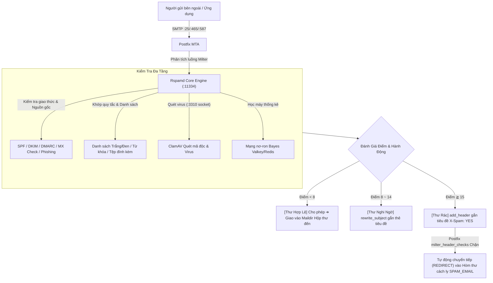

# 🛡️ Hướng Dẫn Bảo Mật Email & Quản Trị Rspamd Web UI

Dự án tích hợp sâu **Công cụ lọc thư rác hiệu năng cao Rspamd**, **Quét mã độc ClamAV**, **Danh sách trắng/đen đa chiều**, **Giải nén kiểm tra tệp đính kèm chuyên sâu**, và kiến trúc **Cách ly không trả thư (Zero-Bounce Quarantine `SPAM_EMAIL`)** nhằm cung cấp giải pháp bảo mật toàn diện cho máy chủ thư điện tử doanh nghiệp.

---

## 🏛️ 1. Kiến Trúc Lọc & Quy Trình Xử Lý Thư



---

## 🌐 2. Giao Diện Quản Trị Web (Web UI)

Rspamd tích hợp sẵn giao diện Web hiện đại, cung cấp số liệu phân tích thời gian thực, điều chỉnh quy tắc lọc trực tuyến, quản lý danh sách trắng/đen và công cụ quét học máy.

### 🔑 Thông Tin Đăng Nhập & Địa Chỉ Truy Cập
- **Địa chỉ Web UI**: `http://<IP_MÁY_CHỦ>:11334`
  > 💡 **Ghi chú**: Nếu máy chủ có cấu hình Reverse Proxy (như Nginx, Proxmox Mail Gateway hoặc chứng chỉ SSL Apache), bạn cũng có thể truy cập an toàn qua `https://<TÊN_MIỀN>:11334` hoặc đường dẫn phụ.
- **Mật khẩu quản trị mặc định**: **`kafeiou.pw`**

---

### 🔒 Hướng Dẫn Đổi Mật Khẩu Web UI

Để thay đổi mật khẩu quản trị mặc định, hãy thực hiện các bước sau trên máy chủ:

#### Bước 1: Tạo mã băm mật khẩu mới (Hash)
```bash
docker exec -it mailserver rspamadm pw --encrypt -p 'MatKhauMoiCuaBan'
```
*Kết quả ví dụ: `$2$tmssocwxeoue5888d64preqqkn5sx733$om8jyy4agf9qff5rdcmkk4t6hk4nzhrnyd51eo14fqqtmaq1suey`*

#### Bước 2: Cập nhật tệp cấu hình
Chỉnh sửa tệp `local.d/worker-controller.inc` trong thư mục volume `mailserver_rspamd_conf` trên máy chủ:
```ini
password = "$2$chuoi_hash_vua_tao";
bind_socket = "0.0.0.0:11334";
```

#### Bước 3: Nạp lại cấu hình ngay lập tức (Không cần khởi động lại container)
```bash
docker exec -it mailserver rspamadm control reload
```

---

## 📦 3. Cơ Chế Cách Ly Không Trả Thư (Zero-Bounce) & Khôi Phục `SPAM_EMAIL`

Các máy chủ email truyền thống khi phát hiện thư rác thường trả về `5xx Reject`, điều này gây ra hai rủi ro lớn:
1. **Dò quét tài khoản**: Kẻ gửi thư rác có thể dựa vào phản hồi lỗi để xác định tài khoản nội bộ có tồn tại hay không.
2. **Mất thư kinh doanh quan trọng**: Nếu thư của khách hàng bị cấu hình sai SPF nhẹ dẫn đến nhận diện nhầm, thư sẽ bị từ chối vĩnh viễn và không thể lấy lại.

### 🛡️ Cơ Chế Bảo Vệ Tích Hợp:
1. **Chính sách không trả thư (Zero-Bounce)**: Trong [`actions.conf`](rspamd/local.d/actions.conf), `reject` được đặt thành `null`. Thư rác điểm cao (≧ 15 điểm) sẽ thực thi `add_header` (gắn thẻ `X-Spam: YES` và `X-Rspamd-Action: add header`).
2. **Tự động chuyển hướng cách ly**: Postfix bắt các tiêu đề này thông qua [`milter_header_checks`](postfix_config/milter_header_checks) và tự động thực hiện lệnh `REDIRECT` về hòm thư chỉ định **`SPAM_EMAIL`** (ví dụ: `spam@kafeiou.pw`, mặc định là `postmaster`).

---

### 🎣 Cách Quản Trị Viên Khôi Phục Thư Nhận Diện Nhầm

Khi người dùng phản hồi không nhận được thư của đối tác, quản trị viên có thể dễ dàng khôi phục:

1. **Mở ứng dụng Email**: Đăng nhập vào hòm thư **`SPAM_EMAIL`** (ví dụ: `spam@kafeiou.pw`) bằng Thunderbird, Outlook hoặc Webmail.
2. **Tìm kiếm và nhận diện**:
   - Tiêu đề thư cách ly có ghi chú rõ ràng:
     - `X-Spam: YES`
     - `X-Rspamd-Action: add header`
     - `X-Quarantine-Reason: High spam score`
3. **Khôi phục chỉ với 1 thao tác**: Nhấn **"Chuyển tiếp (Forward)"** hoặc **"Gửi lại (Resend)"** thư đó đến đúng người nhận nội bộ. Không làm gián đoạn công việc!

---

## 📑 4. Quản Lý Danh Sách Trắng / Đen (Trực Tuyến Qua Web UI)

Quản trị viên không cần truy cập máy chủ sửa tệp cấu hình thủ công. Bạn có thể quản lý trực quan trên **Rspamd Web UI**:

1. Đăng nhập `http://<IP_MÁY_CHỦ>:11334`.
2. Chuyển đến mục **"Configuration" ➔ "Maps"** trên thanh điều hướng.
3. Nhấp vào danh sách tương ứng để thêm, sửa hoặc xóa. **Cấu hình có hiệu lực ngay sau khi lưu**!

---

### 📋 Các Danh Sách Phổ Biến & Ví Dụ Thực Tế:

#### ① Danh sách trắng tên miền (`LOCAL_WL_DOMAIN`)
- **Đường dẫn**: `$CONFDIR/override.d/local_wl_domain.inc`
- **Tác dụng**: Cho phép toàn bộ email từ các tên miền tin cậy đi qua mà không bị tính điểm thư rác.
- **Ví dụ**:
  ```text
  google.com
  microsoft.com
  smile.taipei
  important-partner.com.tw
  ```

#### ② Danh sách trắng địa chỉ Email (`LOCAL_WL_FROM`)
- **Đường dẫn**: `$CONFDIR/override.d/local_wl_from.inc`
- **Ví dụ**:
  ```text
  boss@partner-company.com
  vip-service@bank.com.tw
  ```

#### ③ Danh sách trắng IP / Dải mạng (`LOCAL_WL_IP`)
- **Đường dẫn**: `$CONFDIR/override.d/local_wl_ip.inc`
- **Ví dụ**:
  ```text
  10.192.130.0/24
  192.168.1.100
  203.0.113.50
  ```

#### ④ Danh sách đen tên miền (`CUSTOM_BLOCK_HEADER`)
- **Đường dẫn**: `/etc/rspamd/override.d/blacklist.inc`
- **Tác dụng**: Cộng ngay **+40.0 điểm**, tự động kích hoạt chuyển tiếp vào hòm thư cách ly.
- **Ví dụ**:
  ```text
  phishing-scam.xyz
  spammer-network.top
  ```

#### ⑤ Danh sách đen người gửi (`LOCAL_BL_FROM`)
- **Đường dẫn**: `$CONFDIR/override.d/local_bl_from.map.inc`
- **Ví dụ**:
  ```text
  service@fake-bank-alert.com
  lottery-winner@promo.net
  ```

#### ⑥ Chặn tuyệt đối theo tiêu đề (`W_SPAM_SUBJECT_DENY`)
- **Đường dẫn**: `$CONFDIR/override.d/w_spam_subject_deny.inc`
- **Tác dụng**: Hỗ trợ biểu thức chính quy (Regex), cộng ngay **+100.0 điểm** để cách ly tuyệt đối!
- **Ví dụ**:
  ```text
  /online casino/i
  /lottery winner.*claim now/i
  /Bitcoin.*Transfer.*Claim/i
  /urgent.*wire transfer.*verification/i
  ```

#### ⑦ Lọc từ khóa nội dung thư (`W_CONTENT_SPAM_TEXT`)
- **Đường dẫn**: `/etc/rspamd/override.d/content_keywords.map`
- **Ví dụ**:
  ```text
  /daily high income guaranteed/i
  /claim government subsidy/i
  /Your account has been suspended.*click here/i
  ```

#### ⑧ Chặn tệp đính kèm nguy hiểm (`BAD_ATTACHMENT` / `BAD_ARCHIVE_ATTACHMENT`)
- **Đường dẫn**: `/etc/rspamd/local.d/bad_extensions.map`
- **Tác dụng**: Chặn các tệp thực thi độc hại đính kèm trực tiếp hoặc **nằm sâu trong tệp nén ZIP/RAR** (+15.0 điểm).
- **Danh sách đuôi tệp mặc định**:
  ```text
  exe
  bat
  vbs
  scr
  js
  cmd
  ps1
  hta
  jar
  ```

---

## 🧠 5. Quét Virus ClamAV & Học Máy Bayes (Bayesian Learning)

### 🦠 Tích hợp diệt virus ClamAV
- Rspamd tự động chuyển toàn bộ tệp đính kèm qua Socket `/var/run/clamd.scan/clamd.sock` để ClamAV quét mã độc và virus.
- Thư có virus sẽ bị đánh dấu và cách ly tự động theo chính sách.

### 📚 Huấn luyện bộ phân loại Bayes
Rspamd có khả năng tự học thống kê. Quản trị viên có thể huấn luyện hệ thống bằng thư sạch (Ham) và thư rác (Spam):

#### Cách A: Huấn luyện qua giao diện Web UI
1. Vào tab **"Scan / Learn"** trên Web UI.
2. Dán nội dung mã nguồn email (`.eml`).
3. Nhấp **"Learn Ham"** (thư sạch) hoặc **"Learn Spam"** (thư rác).

#### Cách B: Huấn luyện hàng loạt qua lệnh CLI
```bash
# Huấn luyện thư sạch (Ham)
docker exec -it mailserver rspamc learn_ham /path/to/clean_mail.eml

# Huấn luyện thư rác (Spam)
docker exec -it mailserver rspamc learn_spam /path/to/spam_mail.eml
```

---

## ⚡ 6. Bảng Tra Cứu Lệnh Quản Trị Nhanh

| Mục đích | Lệnh thực thi |
| :--- | :--- |
| **Nạp lại cấu hình Rspamd (Không gián đoạn)** | `docker exec -it mailserver rspamadm control reload` |
| **Tạo mã băm mật khẩu mới** | `docker exec -it mailserver rspamadm pw --encrypt -p '<mat_khau_moi>'` |
| **Kiểm tra cú pháp cấu hình** | `docker exec -it mailserver rspamadm configtest` |
| **Xem trực tiếp nhật ký quét Rspamd** | `docker exec -it mailserver tail -f /var/log/rspamd/rspamd.log` |
| **Xem bộ đếm thống kê** | `docker exec -it mailserver rspamc stat` |
| **Quét kiểm tra thử 1 tệp EML** | `docker exec -it mailserver rspamc symbols < /path/to/mail.eml` |
