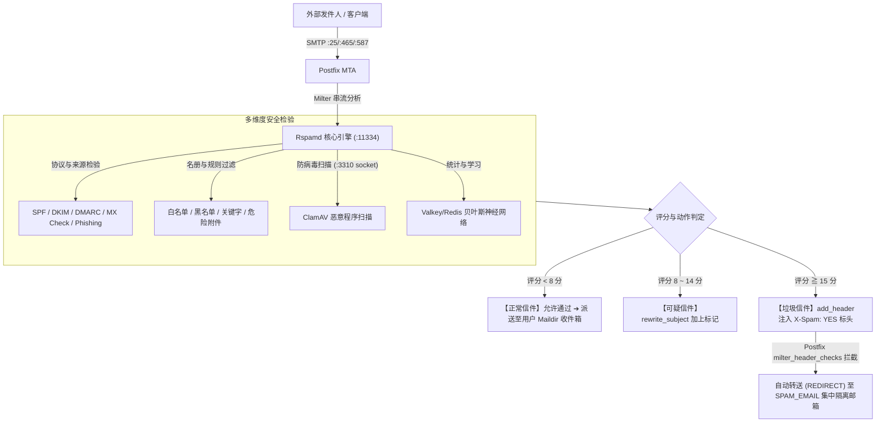

# 🛡️ Rspamd 邮件安全防护与 Web 控制台运维指南

本专案深度整合了高性能的 **Rspamd 邮件过滤引擎**、**ClamAV 防病毒扫描**、**多维度黑白名单**、**危险附件深度解包** 与 **零退信安全隔离（`SPAM_EMAIL`）** 机制，为企业邮件服务器提供全方位的安全防护。

---

## 🏛️ 1. 系统过滤架构与运作流程



---

## 🌐 2. Web 控制台与管理员登录

Rspamd 内置现代化 Web 控制台，提供实时流量统计、过滤规则在线调整、黑白名单管理与扫描学习等功能。

### 🔑 登录信息与网址
- **Web UI 网址**：`http://<服务器IP>:11334`
  > 💡 **备注**：若宿主机前端配置了反向代理（如 Nginx、Proxmox Mail Gateway 或 Apache SSL 证书），亦可通过 `https://<域名>:11334` 或指定子路径访问。
- **默认管理员密码**：**`kafeiou.pw`**

---

### 🔒 修改 Web 控制台密码教学

如需修改默认管理员密码，请在宿主机执行以下步骤：

#### 步骤 1：生成新密码加密哈希（Hash）
```bash
docker exec -it mailserver rspamadm pw --encrypt -p '您的新密码'
```
*执行后会输出一段加密字符串，例如：`$2$tmssocwxeoue5888d64preqqkn5sx733$om8jyy4agf9qff5rdcmkk4t6hk4nzhrnyd51eo14fqqtmaq1suey`*

#### 步骤 2：更新配置文件
编辑宿主机持久化挂载的 `mailserver_rspamd_conf` 目录中的 `local.d/worker-controller.inc`：
```ini
password = "$2$您的加密哈希字符串";
bind_socket = "0.0.0.0:11334";
```

#### 步骤 3：即时重载生效（免重启容器）
```bash
docker exec -it mailserver rspamadm control reload
```

---

## 📦 3. 零退信与 `SPAM_EMAIL` 安全隔离救援机制

传统邮件服务器判定垃圾邮件时若直接返回 `5xx Reject`（拒收退信），容易引发两大弊端：
1. **攻击者探测**：垃圾发信者可借由退信状态确认企业账号是否存在。
2. **重要商务邮件遗失**：若客户的重要询价邮件因 SPF 设置不良而被误判，将直接遭到拒收而无从找回。

### 🛡️ 专案防护机制：
1. **不拒收（Zero-Bounce）**：在 [`actions.conf`](rspamd/local.d/actions.conf) 中将 `reject` 设为 `null`，评分达 15 分以上时一律执行 `add_header`（注入 `X-Spam: YES` 与 `X-Rspamd-Action: add header`）。
2. **自动转送隔离**：Postfix 通过 [`milter_header_checks`](postfix_config/milter_header_checks) 拦截垃圾邮件标头，自动重定向（`REDIRECT`）至环境变量指定的 **`SPAM_EMAIL`**（如 `spam@kafeiou.pw`，默认值为 `postmaster`）。

---

### 🎣 网管如何从隔离邮箱找回误判邮件？

若用户反馈未收到客户邮件，管理员可通过以下简单直观的方式救援：

1. **打开邮件客户端**：使用 Thunderbird、Outlook 或 Webmail 登录 **`SPAM_EMAIL`** 专属邮箱（例如 `spam@kafeiou.pw`）。
2. **搜索与辨识**：
   - 隔离邮件标头会清晰注明：
     - `X-Spam: YES`
     - `X-Rspamd-Action: add header`
     - `X-Quarantine-Reason: High spam score`
3. **一键救回**：在邮件客户端中直接将该邮件 **「转发 (Forward)」** 或 **「重新发送 (Resend)」** 给原收件同仁，业务零中断！

---

## 📑 4. 黑白名单与过滤名册维护 (Web UI 在线管理)

管理员无需手动登录服务器修改文本文件，可直接通过 **Rspamd Web 控制台** 进行可视化在线管理：

1. 登录 `http://<服务器IP>:11334`。
2. 点击顶部导航栏的 **「Configuration」➔「Maps」** 分页。
3. 点击对应的名册即可在线新增、删除或修改，**保存后系统实时自动生效**！

---

### 📋 常见名册与规则实战范例：

#### ① 域名白名单 (`LOCAL_WL_DOMAIN`)
- **名册路径**：`$CONFDIR/override.d/local_wl_domain.inc`
- **效果**：来自此域名的所有邮件免受垃圾邮件评分干扰。
- **范例内容**：
  ```text
  google.com
  microsoft.com
  smile.taipei
  important-partner.com.tw
  ```

#### ② 发件人 Email 白名单 (`LOCAL_WL_FROM`)
- **名册路径**：`$CONFDIR/override.d/local_wl_from.inc`
- **效果**：精准放行指定外部 VIP 或合作伙伴邮箱。
- **范例内容**：
  ```text
  boss@partner-company.com
  vip-service@bank.com.tw
  ```

#### ③ 来源 IP / 网段白名单 (`LOCAL_WL_IP`)
- **名册路径**：`$CONFDIR/override.d/local_wl_ip.inc`
- **效果**：放行公司内部网段、分公司固定 IP 或特定中继主机。
- **范例内容**：
  ```text
  10.192.130.0/24
  192.168.1.100
  203.0.113.50
  ```

#### ④ 域名黑名单 (`CUSTOM_BLOCK_HEADER`)
- **名册路径**：`/etc/rspamd/override.d/blacklist.inc`
- **效果**：命中直接给予 **+40.0 分** 高分，立即触发转送至隔离邮箱。
- **范例内容**：
  ```text
  phishing-scam.xyz
  spammer-network.top
  ```

#### ⑤ 恶意发件人黑名单 (`LOCAL_BL_FROM`)
- **名册路径**：`$CONFDIR/override.d/local_bl_from.map.inc`
- **范例内容**：
  ```text
  service@fake-bank-alert.com
  lottery-winner@promo.net
  ```

#### ⑥ 主旨绝对阻挡规则 (`W_SPAM_SUBJECT_DENY`)
- **名册路径**：`$CONFDIR/override.d/w_spam_subject_deny.inc`
- **效果**：支持正则表达式（Regex），命中直接给予 **+100.0 分** 绝对隔离！
- **范例内容**：
  ```text
  /线上百家乐/i
  /发票中奖通知.*请点击/i
  /Bitcoin.*Transfer.*Claim/i
  /急件.*汇款.*确认/i
  ```

#### ⑦ 正文关键字特征 (`W_CONTENT_SPAM_TEXT`)
- **名册路径**：`/etc/rspamd/override.d/content_keywords.map`
- **范例内容**：
  ```text
  /兼职日领/i
  /点此领取政府补贴/i
  /Your account has been suspended.*click here/i
  ```

#### ⑧ 危险附件后缀名拦截 (`BAD_ATTACHMENT` / `BAD_ARCHIVE_ATTACHMENT`)
- **名册路径**：`/etc/rspamd/local.d/bad_extensions.map`
- **效果**：阻挡直接夹带或**藏在 ZIP/RAR 压缩包内部**的恶意可执行文件（命中 +15.0 分）。
- **默认阻挡清单**：
  ```text
  exe
  bat
  vbs
  scr
  js
  cmd
  ps1
  hta
  jar
  ```

---

## 🧠 5. ClamAV 防病毒扫描与贝叶斯学习（Bayes Learning）

### 🦠 ClamAV 防病毒整合
- Rspamd 通过本地 Socket `/var/run/clamd.scan/clamd.sock` 自动将所有邮件附件送交 ClamAV 进行木马与恶意程序扫描。
- 若附件查出病毒，将自动标记并依策略进行重写或隔离处理。

### 📚 贝叶斯分类器（Bayesian Classifier）训练
Rspamd 内置自我学习能力，网管可主动导入正常邮件与垃圾邮件进行训练：

#### 方法 A：通过 Web 控制台界面训练
1. 进入 Web 控制台的 **「Scan / Learn」** 分页。
2. 将邮件源码（`.eml` 内容）粘贴至文本框。
3. 点击 **「Learn Ham」**（训练为正常邮件）或 **「Learn Spam」**（训练为垃圾邮件）。

#### 方法 B：通过命令行批量训练
```bash
# 训练正常邮件 (Ham)
docker exec -it mailserver rspamc learn_ham /path/to/clean_mail.eml

# 训练垃圾邮件 (Spam)
docker exec -it mailserver rspamc learn_spam /path/to/spam_mail.eml
```

---

## ⚡ 6. 管理员常用运维指令速查表

| 运维需求 | 终端执行指令 |
| :--- | :--- |
| **重载 Rspamd 配置（免重启）** | `docker exec -it mailserver rspamadm control reload` |
| **生成新密码 Hash** | `docker exec -it mailserver rspamadm pw --encrypt -p '<新密码>'` |
| **检查配置文件语法正确性** | `docker exec -it mailserver rspamadm configtest` |
| **实时查看 Rspamd 扫描日志** | `docker exec -it mailserver tail -f /var/log/rspamd/rspamd.log` |
| **查看 Rspamd 统计计数器** | `docker exec -it mailserver rspamc stat` |
| **手动扫描测试单封邮件** | `docker exec -it mailserver rspamc symbols < /path/to/mail.eml` |
