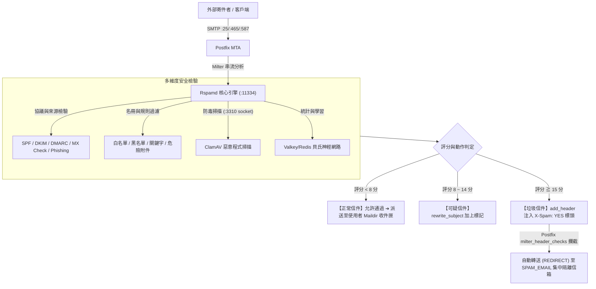

# 🛡️ Rspamd 郵件安全防護與 Web 控制台維運指南

本專案深度整合了高效能的 **Rspamd 郵件過濾引擎**、**ClamAV 防毒掃描**、**多維度黑白名單**、**危險附件深度解包** 與 **零退信安全隔離（`SPAM_EMAIL`）** 機制，為企業郵件伺服器提供全方位的安全防護。

---

## 🏛️ 1. 系統過濾架構與運作流程



---

## 🌐 2. Web 控制台與管理員登入

Rspamd 內建現代化 Web 控制台，提供即時流量統計、過濾規則線上調整、黑白名單管理與掃描學習等功能。

### 🔑 登入資訊與網址
- **Web UI 網址**：`http://<伺服器IP>:11334`
  > 💡 **備註**：若宿主機前端有配置反向代理（如 Nginx、Proxmox Mail Gateway 或 Apache SSL 憑證），亦可透過 `https://<網域名稱>:11334` 或指定子路徑存取。
- **預設管理員密碼**：**`kafeiou.pw`**

---

### 🔒 修改 Web 控制台密碼教學

如需修改預設管理員密碼，請在宿主機執行以下步驟：

#### 步驟 1：產生新密碼加密雜湊（Hash）
```bash
docker exec -it mailserver rspamadm pw --encrypt -p '您的新密碼'
```
*執行後會輸出一段加密字串，例如：`$2$tmssocwxeoue5888d64preqqkn5sx733$om8jyy4agf9qff5rdcmkk4t6hk4nzhrnyd51eo14fqqtmaq1suey`*

#### 步驟 2：更新設定檔
編輯宿主機持久化掛載的 `mailserver_rspamd_conf` 目錄中的 `local.d/worker-controller.inc`：
```ini
password = "$2$您的加密雜湊字串";
bind_socket = "0.0.0.0:11334";
```

#### 步驟 3：即時重載生效（免重啟容器）
```bash
docker exec -it mailserver rspamadm control reload
```

---

## 📦 3. 零退信與 `SPAM_EMAIL` 安全隔離救援機制

傳統郵件伺服器判定垃圾信時若直接回傳 `5xx Reject`（拒收退信），容易引發兩大弊端：
1. **攻擊者探測**：垃圾發信者可藉由退信狀態確認企業帳號是否存在。
2. **重要商務信件遺失**：若客戶的重要詢價信件因 SPF 設定不良而被誤判，將直接遭到拒收而無從找回。

### 🛡️ 專案防護機制：
1. **不拒收（Zero-Bounce）**：在 [`actions.conf`](rspamd/local.d/actions.conf) 中將 `reject` 設為 `null`，評分達 15 分以上時一律執行 `add_header`（注入 `X-Spam: YES` 與 `X-Rspamd-Action: add header`）。
2. **自動轉送隔離**：Postfix 透過 [`milter_header_checks`](postfix_config/milter_header_checks) 攔截垃圾信標頭，自動重定向（`REDIRECT`）至環境變數指定的 **`SPAM_EMAIL`**（如 `spam@kafeiou.pw`，預設為 `postmaster`）。

---

### 🎣 網管如何從隔離信箱找回誤判信件？

若使用者回報未收到客戶信件，管理員可透過以下簡單直覺的方式救援：

1. **開啟郵件軟體**：使用 Thunderbird、Outlook 或 Webmail 登入 **`SPAM_EMAIL`** 專屬信箱（例如 `spam@kafeiou.pw`）。
2. **搜尋與辨識**：
   - 隔離信件標頭會清楚註明：
     - `X-Spam: YES`
     - `X-Rspamd-Action: add header`
     - `X-Quarantine-Reason: High spam score`
3. **一鍵救回**：在郵件客戶端中直接將該信件 **「轉寄 (Forward)」** 或 **「重新發送 (Resend)」** 給原收件同仁，業務零中斷！

---

## 📑 4. 黑白名單與過濾名冊維護 (Web UI 線上管理)

管理員無需手動登入伺服器修改文字檔，可直接透過 **Rspamd Web 控制台** 進行視覺化線上管理：

1. 登入 `http://<伺服器IP>:11334`。
2. 點選頂部導覽列的 **「Configuration」➔「Maps」** 分頁。
3. 點選對應的名冊即可線上新增、刪除或修改，**存檔後系統即時自動生效**！

---

### 📋 常見名冊與規則實戰範例：

#### ① 網域白名單 (`LOCAL_WL_DOMAIN`)
- **名冊路徑**：`$CONFDIR/override.d/local_wl_domain.inc`
- **效果**：來自此網域的所有信件免受垃圾評分干擾。
- **範例內容**：
  ```text
  google.com
  microsoft.com
  smile.taipei
  important-partner.com.tw
  ```

#### ② 寄件者 Email 白名單 (`LOCAL_WL_FROM`)
- **名冊路徑**：`$CONFDIR/override.d/local_wl_from.inc`
- **效果**：精準放行指定外部 VIP 或合作夥伴信箱。
- **範例內容**：
  ```text
  boss@partner-company.com
  vip-service@bank.com.tw
  ```

#### ③ 來源 IP / 網段白名單 (`LOCAL_WL_IP`)
- **名冊路徑**：`$CONFDIR/override.d/local_wl_ip.inc`
- **效果**：放行公司內部網段、分公司固定 IP 或特定中繼主機。
- **範例內容**：
  ```text
  10.192.130.0/24
  192.168.1.100
  203.0.113.50
  ```

#### ④ 網域黑名單 (`CUSTOM_BLOCK_HEADER`)
- **名冊路徑**：`/etc/rspamd/override.d/blacklist.inc`
- **效果**：命中直接給予 **+40.0 分** 高分，立即觸發轉送至隔離信箱。
- **範例內容**：
  ```text
  phishing-scam.xyz
  spammer-network.top
  ```

#### ⑤ 惡意寄件者黑名單 (`LOCAL_BL_FROM`)
- **名冊路徑**：`$CONFDIR/override.d/local_bl_from.map.inc`
- **範例內容**：
  ```text
  service@fake-bank-alert.com
  lottery-winner@promo.net
  ```

#### ⑥ 主旨絕對阻擋規則 (`W_SPAM_SUBJECT_DENY`)
- **名冊路徑**：`$CONFDIR/override.d/w_spam_subject_deny.inc`
- **效果**：支援正則表達式（Regex），命中直接給予 **+100.0 分** 絕對隔離！
- **範例內容**：
  ```text
  /線上百家樂/i
  /發票中獎通知.*請點擊/i
  /Bitcoin.*Transfer.*Claim/i
  /急件.*匯款.*確認/i
  ```

#### ⑦ 內文關鍵字特徵 (`W_CONTENT_SPAM_TEXT`)
- **名冊路徑**：`/etc/rspamd/override.d/content_keywords.map`
- **範例內容**：
  ```text
  /兼職日領/i
  /點此領取政府補助/i
  /Your account has been suspended.*click here/i
  ```

#### ⑧ 危險附件副檔名攔截 (`BAD_ATTACHMENT` / `BAD_ARCHIVE_ATTACHMENT`)
- **名冊路徑**：`/etc/rspamd/local.d/bad_extensions.map`
- **效果**：阻擋直接夾帶或**藏在 ZIP/RAR 壓縮檔內部**的惡意執行檔（命中 +15.0 分）。
- **預設阻擋清單**：
  ```text
  exe
  bat
  vbs
  scr
  js
  cmd
  ps1
  hta
  jar
  ```

---

## 🧠 5. ClamAV 防毒掃描與貝氏學習（Bayes Learning）

### 🦠 ClamAV 防毒整合
- Rspamd 透過本機 Socket `/var/run/clamd.scan/clamd.sock` 自動將所有郵件附件送交 ClamAV 進行木馬與惡意程式掃描。
- 若附件驗出病毒，將自動標記並依政策進行重寫或隔離處理。

### 📚 貝氏分類器（Bayesian Classifier）訓練
Rspamd 內建自我學習能力，網管可主動餵入正常信件與垃圾信件進行訓練：

#### 方法 A：透過 Web 控制台介面訓練
1. 進入 Web 控制台的 **「Scan / Learn」** 分頁。
2. 將信件原始碼（`.eml` 內容）貼入文字框。
3. 點選 **「Learn Ham」**（訓練為正常信）或 **「Learn Spam」**（訓練為垃圾信）。

#### 方法 B：透過命令列批次訓練
```bash
# 訓練正常郵件 (Ham)
docker exec -it mailserver rspamc learn_ham /path/to/clean_mail.eml

# 訓練垃圾郵件 (Spam)
docker exec -it mailserver rspamc learn_spam /path/to/spam_mail.eml
```

---

## ⚡ 6. 管理員常用維運指令速查表

| 維運需求 | 終端機執行指令 |
| :--- | :--- |
| **重載 Rspamd 設定（免重啟）** | `docker exec -it mailserver rspamadm control reload` |
| **產生新密碼 Hash** | `docker exec -it mailserver rspamadm pw --encrypt -p '<新密碼>'` |
| **檢查設定檔語法正確性** | `docker exec -it mailserver rspamadm configtest` |
| **即時監看 Rspamd 掃描日誌** | `docker exec -it mailserver tail -f /var/log/rspamd/rspamd.log` |
| **查看 Rspamd 統計計數器** | `docker exec -it mailserver rspamc stat` |
| **手動掃描測試單封信件** | `docker exec -it mailserver rspamc symbols < /path/to/mail.eml` |
